> Anexo largo. Lectura corta: [arquitectura.md](arquitectura.md).

# Documento maestro — Arquitectura de Deploya

> Insumo para el documento formal de diseño (otro agente). Diagramas Mermaid **embebidos**, no solo enlaces.
> Fuente de producto: `00_GUIA_GENERAL_Propuesta_Deploya.md`. Originales de compañeros intactos; este maestro usa versiones pulidas (sin prefijo `I`, español de la propuesta).
> ERD y clases: **un solo artefacto** cada uno (`DEPLOYA_erd_unificado.mmd`, `DEPLOYA_diagrama_clases_unificado.mmd`).

## Índice

1. Qué es Deploya
2. Arquitectura C4
3. Capa de herramientas M8
4. UML por módulo (compañeros, nombres corregidos)
5. Sistema de diseño (en curso)
6. ERD unificado
7. Diagrama de clases unificado
8. Estados
9. Secuencias
10. Actividades
11. Auditoría resumida
12. Extracto de la propuesta (módulos y estados)

---

## 1. Qué es Deploya

Deploya es una plataforma como servicio (PaaS) orientada al alojamiento de aplicaciones y sitios web. Un desarrollador pasa de un repositorio (o un archivo comprimido) a una aplicación en línea, con subdominio y certificado HTTPS, sin escribir configuración de infraestructura ni administrar servidores.

Recorrido (§3.1): registro y verificación de correo → contratación de plan (pago simulado) → alta de proyecto → construcción encolada → contenedor aislado con HTTPS → métricas, reinicio, variables, nuevo despliegue o reversión.

Arquitectura (§7): **monolito modular** (NestJS + Next.js) con **trabajadores asíncronos**. La API no invoca Docker ni el enrutador de borde: pide la operación a adaptadores (`ContenedorPuerto`, `EnrutamientoPuerto`, `VerificacionEntornoPuerto`). Stack: PostgreSQL, Redis, Docker, enrutador de borde con TLS automático.

Ciclo de despliegue (§3.2): **Recepción → Construcción → Ejecución → Enrutamiento → Operación**. Cada despliegue produce un **artefacto versionado e inmutable**. La reversión levanta un artefacto ya construido; no reconstruye.

---

## 2. Arquitectura C4

### 2.1 Contexto (nivel 1)

Actores: Cliente, Administrador, Operador de infraestructura, Soporte técnico.
Externos: Git, motor de contenedores, DNS, autoridad certificadora, correo, pasarela simulada, modelo de lenguaje (M8).


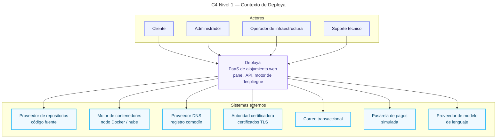

### 2.2 Contenedores (nivel 2)

Web Next.js, API NestJS, motor de despliegue (trabajadores M4–M6), capa de herramientas M8, observabilidad M7, Redis, PostgreSQL. Fuera: Docker, enrutador de borde, Git, correo, pagos, LLM.


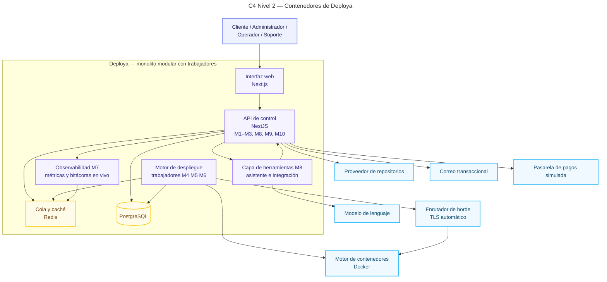

### 2.3 Componentes del motor (nivel 3)

El contenedor «motor» se descompone en M4 (cola, detector, constructor, registro de artefactos), M5 (orquestador, límites, reversión) y M6 (subdominio, TLS, conmutación). Puertos sin prefijo `I`.


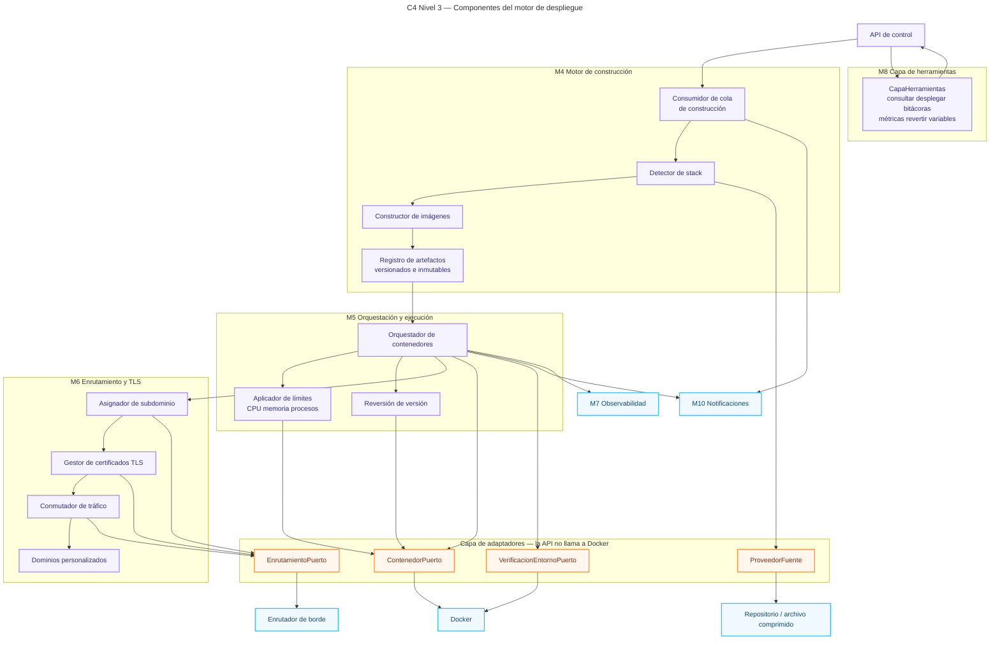

### 2.4 Componentes M4–M6 (detalle de servicios)


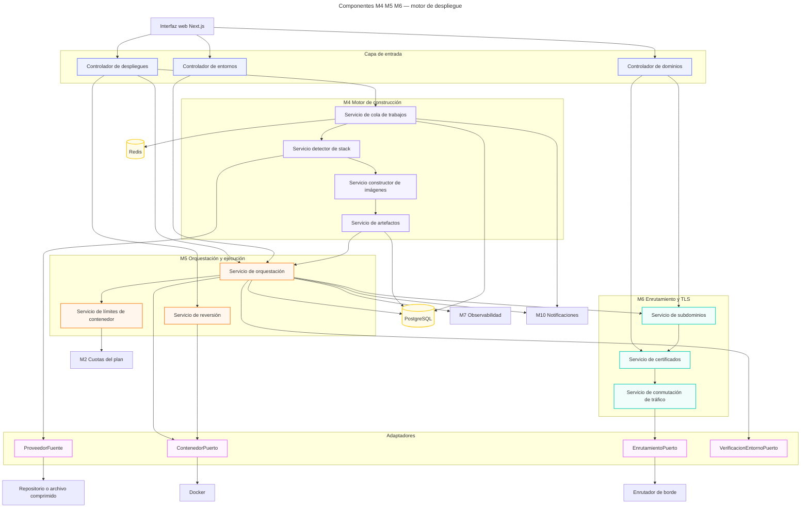

---

## 3. Capa de herramientas M8 (§9.3, §10.3)

Derek integra M4–M6 **y** la capa de herramientas de M8. Misma superficie para el asistente del panel y para clientes externos. Hereda permisos del usuario; operaciones destructivas piden confirmación humana; bitácoras y repositorios son entrada no confiable.


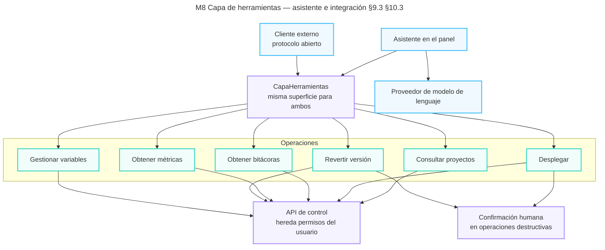

---

## 4. UML por módulo (compañeros, ya corregido)

Los `.mmd` originales no se borran. Aquí va la versión pulida de clases (sin `I`) y el resto de diagramas de compañeros tal cual, salvo que el original ya estaba limpio.

### 4.1 M1 Identidad y acceso + M10 Notificaciones

#### Casos de uso de autenticación


```mermaid
---
config:
  layout: fixed
---
flowchart LR
 subgraph DEPLOYA["."]
        REG(("Registrarse"))
        VERIFY(("Verificar correo"))
        LOGIN(("Iniciar sesión"))
        LOGOUT(("Cerrar sesión"))
        RECOVERY(("Recuperar contraseña"))
        RESET(("Restablecer contraseña"))
        PROFILE(("Consultar perfil"))
        SESSION(("Gestionar sesiones"))
        ACCESS(("Acceder según rol"))
        VALID_REG(("Validar datos de registro"))
        SEND_VERIFY(("Enviar correo de verificación"))
        VALID_TOKEN_VERIFY(("Validar token de verificación"))
        VALID_CREDENTIALS(("Validar credenciales"))
        CREATE_SESSION(("Crear sesión"))
        VALID_PERMISSION(("Validar permisos"))
        GENERATE_RESET(("Generar token de recuperación"))
        SEND_RESET(("Enviar enlace de recuperación"))
        VALID_RESET_TOKEN(("Validar token de recuperación"))
        UPDATE_PASSWORD(("Actualizar contraseña"))
        AUDIT(("Registrar evento de auditoría"))
        RESEND_VERIFY(("Reenviar correo de verificación"))
        NEW_RECOVERY(("Solicitar nuevo enlace de recuperación"))
  end
    CLIENTE["👤 Cliente"] --- REG & VERIFY & LOGIN & LOGOUT & RECOVERY & RESET & PROFILE & SESSION & ACCESS
    ADMIN["👤 Administrador"] --- LOGIN & LOGOUT & SESSION & ACCESS
    OPERADOR["👤 Operador de infraestructura"] --- LOGIN & LOGOUT & SESSION & ACCESS
    SOPORTE["👤 Soporte técnico"] --- LOGIN & LOGOUT & SESSION & ACCESS
    REG -. include .-> VALID_REG & SEND_VERIFY & AUDIT
    VERIFY -. include .-> VALID_TOKEN_VERIFY & AUDIT
    LOGIN -. include .-> VALID_CREDENTIALS & CREATE_SESSION & AUDIT
    LOGOUT -. include .-> AUDIT
    ACCESS -. include .-> VALID_PERMISSION
    RECOVERY -. include .-> GENERATE_RESET & SEND_RESET & AUDIT
    RESET -. include .-> VALID_RESET_TOKEN & UPDATE_PASSWORD & AUDIT
    RESEND_VERIFY -. extend .-> VERIFY
    NEW_RECOVERY -. extend .-> RECOVERY

    linkStyle 0 stroke:#FFD600,fill:none
    linkStyle 1 stroke:#FFD600,fill:none
    linkStyle 2 stroke:#FFD600,fill:none
    linkStyle 3 stroke:#FFD600,fill:none
    linkStyle 4 stroke:#FFD600,fill:none
    linkStyle 5 stroke:#FFD600,fill:none
    linkStyle 6 stroke:#FFD600,fill:none
    linkStyle 7 stroke:#FFD600,fill:none
    linkStyle 8 stroke:#FFD600,fill:none
    linkStyle 9 stroke:#FF6D00,fill:none
    linkStyle 10 stroke:#FF6D00,fill:none
    linkStyle 11 stroke:#FF6D00,fill:none
    linkStyle 12 stroke:#FF6D00,fill:none
    linkStyle 13 stroke:#00C853,fill:none
    linkStyle 14 stroke:#00C853,fill:none
    linkStyle 15 stroke:#00C853,fill:none
    linkStyle 16 stroke:#00C853,fill:none
    linkStyle 17 stroke:#2962FF,fill:none
    linkStyle 18 stroke:#2962FF,fill:none
    linkStyle 19 stroke:#2962FF,fill:none
    linkStyle 20 stroke:#2962FF
```

#### Componentes M1 + M10

El puerto de correo ya no lleva prefijo `I`. En el unificado se nombra `CorreoPuerto`.


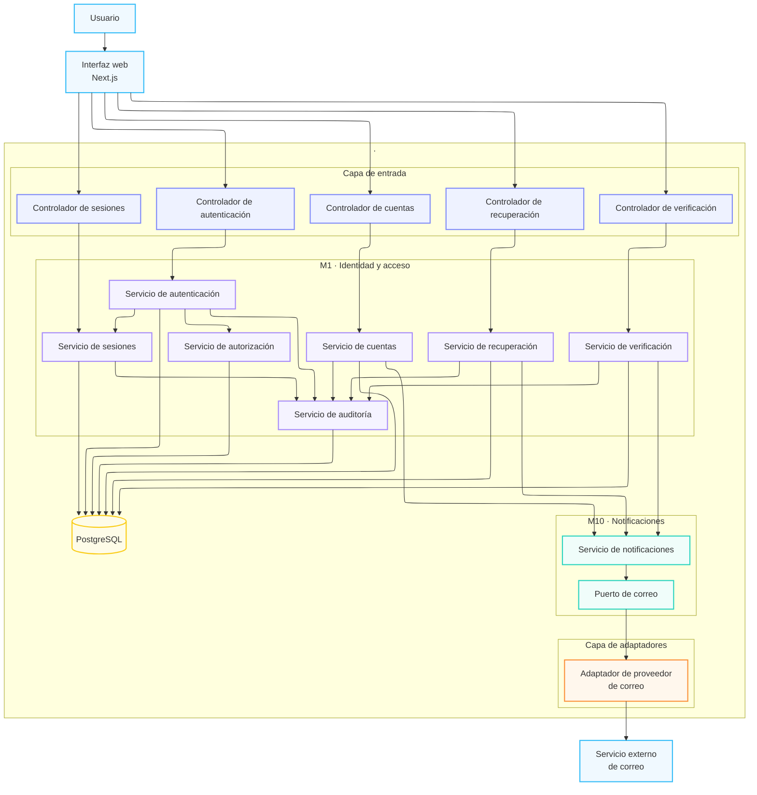

#### Actividad: registro


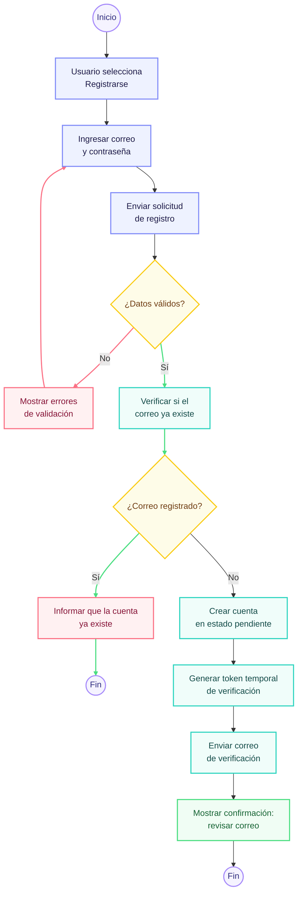

#### Actividad: verificación de correo


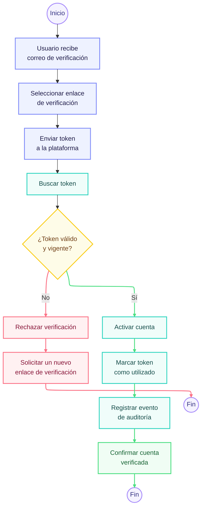

#### Actividad: recuperación de contraseña


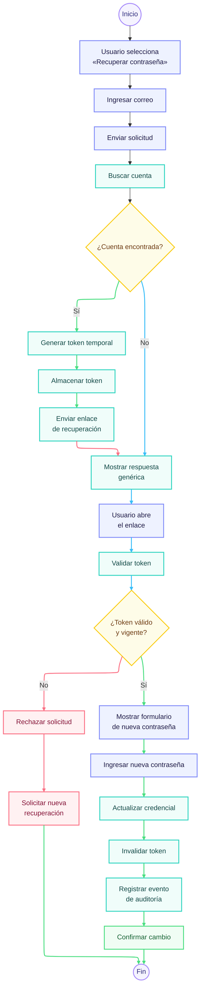

### 4.2 M2 Suscripciones y pagos + M9 Administración

#### Componentes M2 + M9


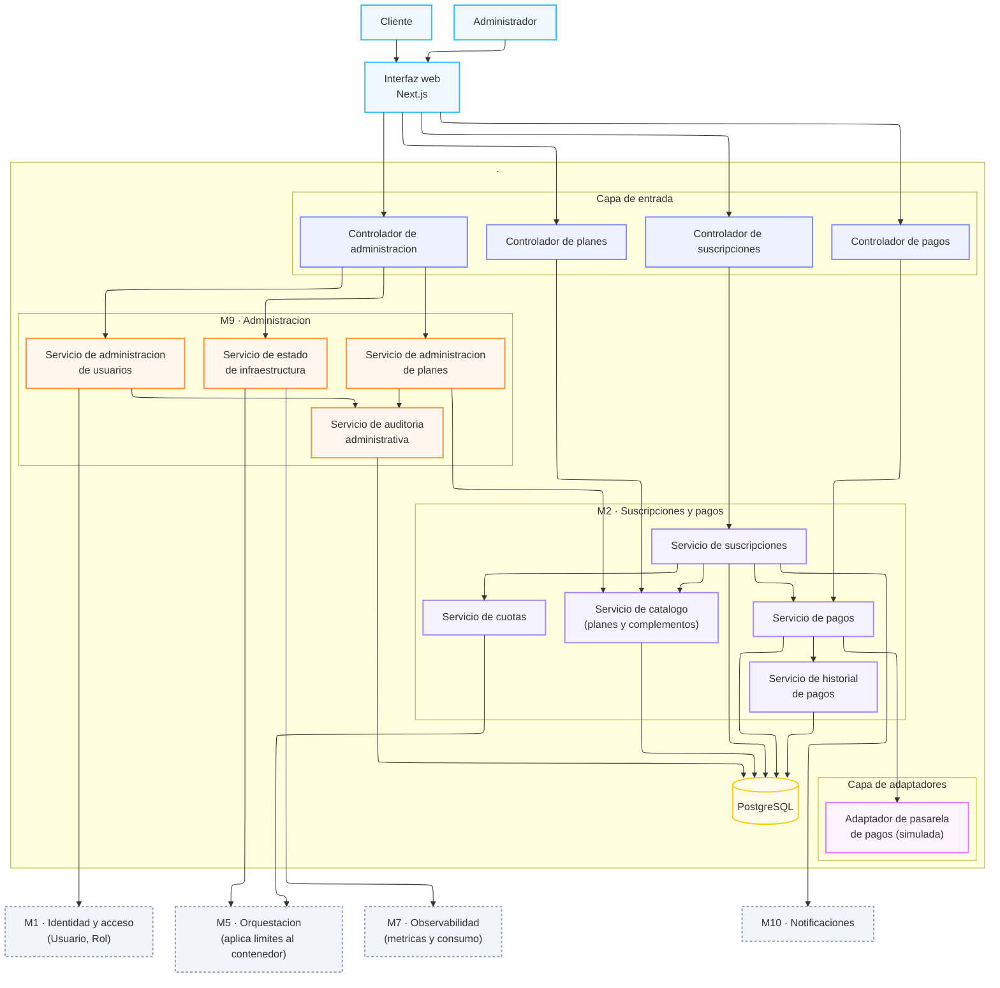

#### Clases M2 + M9 (pulido: `IPasarelaPago` → `PasarelaPago`)

Original conservado: `M2_M9_propuesta_diagrama_clases.mmd`.


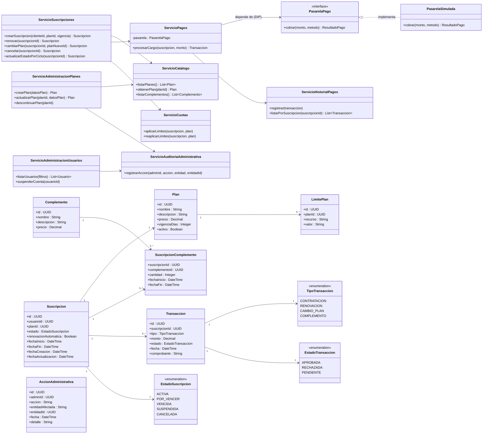

#### Secuencia: contratación de plan


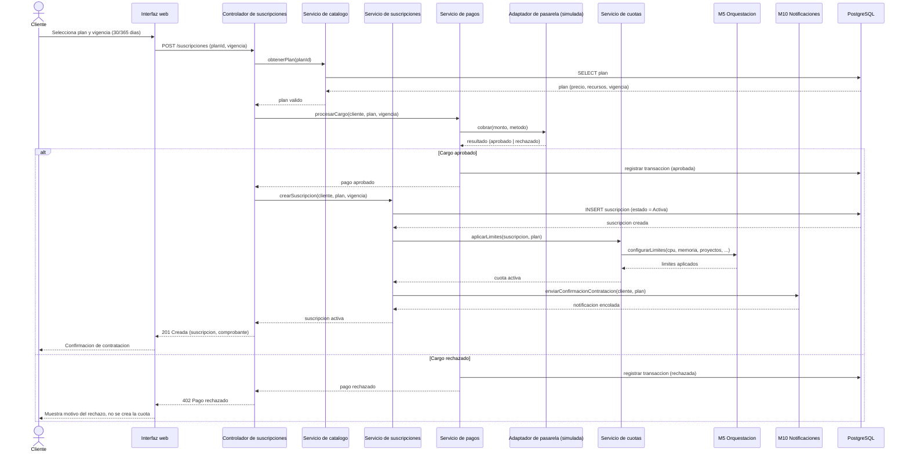

#### Secuencia: renovación


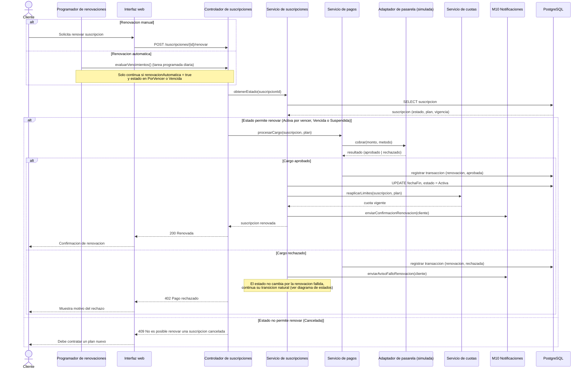

#### Actividad: contratación y activación


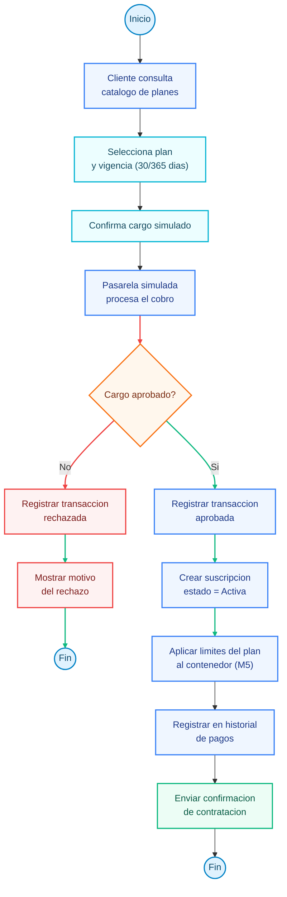

#### Actividad: renovación


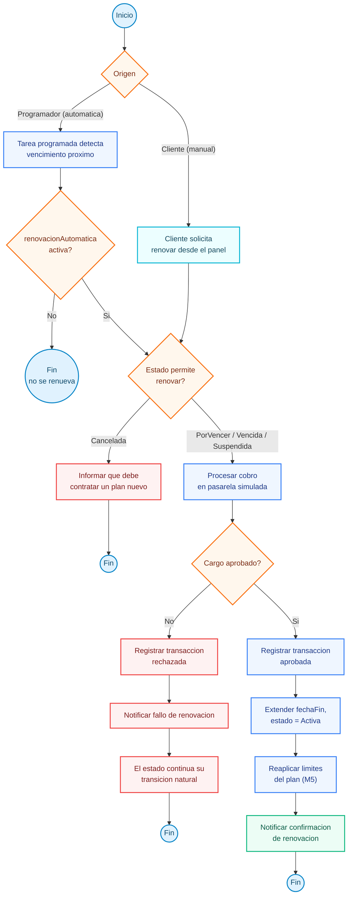

#### Actividad: gestión de planes (M9)


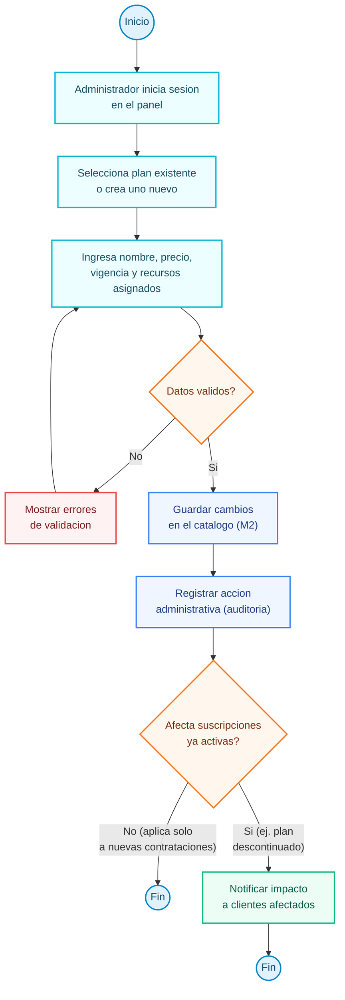

### 4.3 M3 Proyectos y fuentes + M7 Observabilidad

#### Componentes M3 + M7


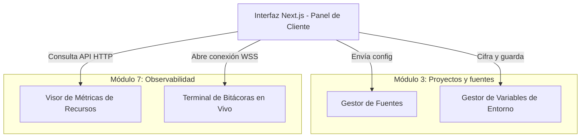

#### Clases M3 + M7 (pulido: `ISourceProvider` → `SourceProvider`; `ProjectController` → `ControladorProyecto`)

Original conservado: `M3_M7_propuesta_diagrama_clases.mmd`. El ERD/clases **canónico** es el unificado (§6 y §7). En el unificado el puerto pasa a `ProveedorFuente` (español de la propuesta).


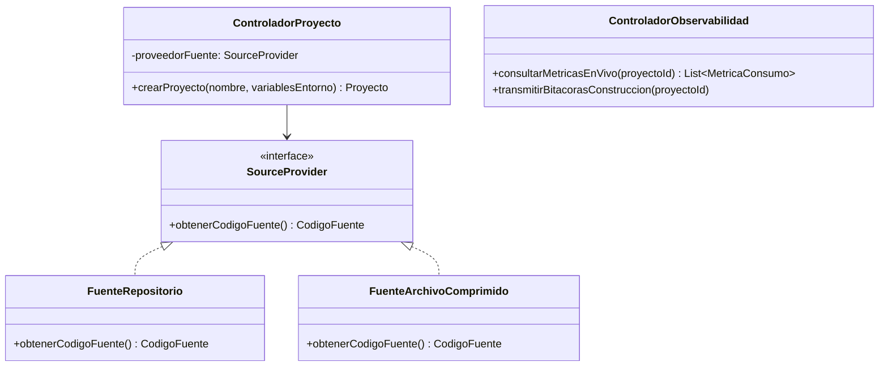

#### Propuesta ERD de compañeros (parcial; no usar como fuente — ver §6)


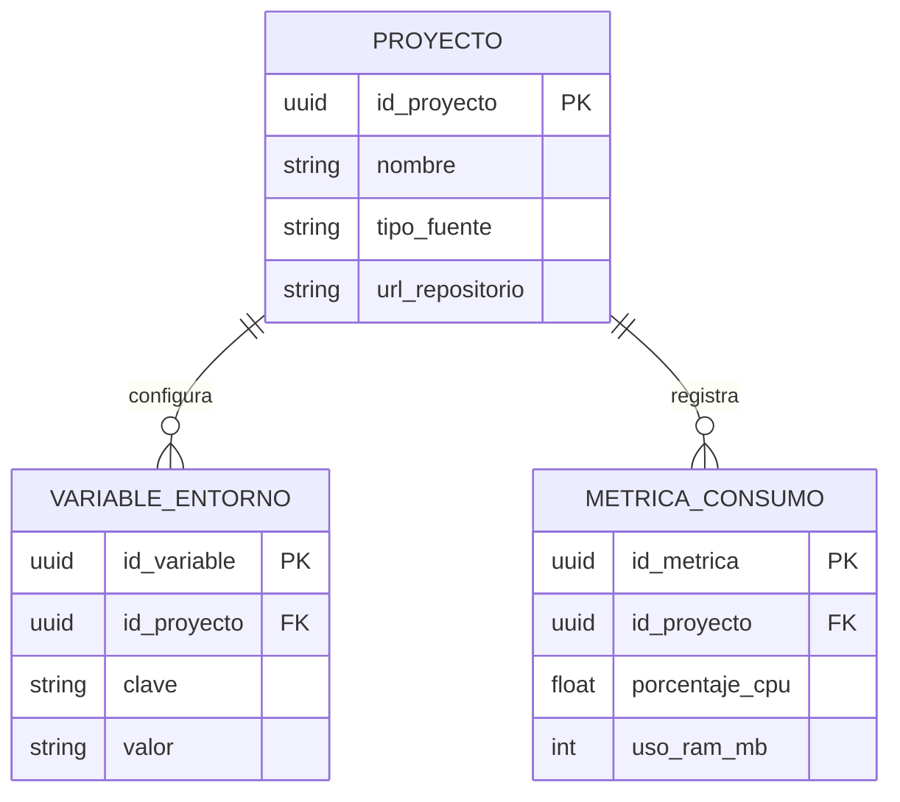

#### Actividad: crear proyecto (original de compañeros; es `stateDiagram-v2`)


```mermaid
stateDiagram-v2
    [*] --> IniciarFormulario
    IniciarFormulario --> IngresarNombreYFuente
    IngresarNombreYFuente --> AgregarVariablesEntorno
    AgregarVariablesEntorno --> ValidarDatos

    state ValidarDatos {
        [*] --> Verificacion
        Verificacion --> DatosInvalidos
        Verificacion --> DatosValidos
    }

    DatosInvalidos --> IngresarNombreYFuente : Corregir errores
    DatosValidos --> EnviarSolicitudDespliegue
    EnviarSolicitudDespliegue --> [*]
```

#### Actividad: consultar métricas (original de compañeros)


```mermaid
stateDiagram-v2
    [*] --> EntrarDashboardProyecto
    EntrarDashboardProyecto --> CargarDatos

    fork
        CargarDatos --> PeticionHTTPMetricas
        PeticionHTTPMetricas --> RenderizarGraficasCPUyRAM
    end

    fork
        CargarDatos --> IniciarConexionWebSocket
        IniciarConexionWebSocket --> RecibirLogsEnVivo
        RecibirLogsEnVivo --> RenderizarConsola
    end

    RenderizarGraficasCPUyRAM --> [*]
    RenderizarConsola --> [*]
```

---

## 5. Sistema de diseño (en curso)

No hay kit visual canónico. Paleta, tipografía y tokens están en diseño; no se copian ni se fijan en este repositorio. La web del bootstrap es un placeholder neutro.

## 6. ERD unificado

Única fuente. Incluye identidad, planes, proyecto, **imagen, artefacto, contenedor, certificado, subdominio**, métricas, notificaciones y administración.


```mermaid
---
title: ERD unificado Deploya — un solo artefacto
---
erDiagram
    USUARIO ||--o{ SESION : abre
    USUARIO }o--|{ ROL : posee
    USUARIO ||--o{ EVENTO_AUDITORIA : origina
    USUARIO ||--o{ TOKEN_CUENTA : recibe
    USUARIO ||--o{ SUSCRIPCION : contrata
    USUARIO ||--o{ ESPACIO_TRABAJO : posee
    USUARIO ||--o{ MIEMBRO_ESPACIO : participa
    USUARIO ||--o{ ACCION_ADMINISTRATIVA : ejecuta

    ROL {
        uuid id PK
        string nombre
        string descripcion
    }

    USUARIO {
        uuid id PK
        string correo UK
        string nombre
        string hashContrasena
        string estadoCuenta
        datetime fechaAlta
    }

    SESION {
        uuid id PK
        uuid usuarioId FK
        datetime expiracion
        string origen
    }

    TOKEN_CUENTA {
        uuid id PK
        uuid usuarioId FK
        string tipo
        string hashToken
        datetime expiracion
        boolean utilizado
    }

    EVENTO_AUDITORIA {
        uuid id PK
        uuid usuarioId FK
        string accion
        string entidad
        uuid entidadId
        datetime fecha
    }

    PLAN ||--o{ LIMITE_PLAN : define
    PLAN ||--o{ SUSCRIPCION : cubre
    COMPLEMENTO ||--o{ SUSCRIPCION_COMPLEMENTO : aplica
    SUSCRIPCION ||--o{ SUSCRIPCION_COMPLEMENTO : incluye
    SUSCRIPCION ||--o{ TRANSACCION : genera

    PLAN {
        uuid id PK
        string nombre
        string descripcion
        decimal precio
        int vigenciaDias
        boolean activo
    }

    LIMITE_PLAN {
        uuid id PK
        uuid planId FK
        string recurso
        decimal cantidad
        string unidad
    }

    COMPLEMENTO {
        uuid id PK
        string nombre
        string descripcion
        decimal precio
    }

    SUSCRIPCION {
        uuid id PK
        uuid usuarioId FK
        uuid planId FK
        string estado
        boolean renovacionAutomatica
        datetime fechaInicio
        datetime fechaFin
    }

    SUSCRIPCION_COMPLEMENTO {
        uuid suscripcionId FK
        uuid complementoId FK
        int cantidad
        datetime fechaInicio
        datetime fechaFin
    }

    TRANSACCION {
        uuid id PK
        uuid suscripcionId FK
        string tipo
        decimal monto
        string estado
        datetime fecha
        string comprobante
    }

    ESPACIO_TRABAJO ||--o{ MIEMBRO_ESPACIO : agrupa
    ESPACIO_TRABAJO ||--o{ PROYECTO : contiene
    PROYECTO ||--o{ VARIABLE_ENTORNO : configura
    PROYECTO ||--o{ DESPLIEGUE : tiene
    PROYECTO ||--o{ DOMINIO_PERSONALIZADO : declara
    PROYECTO ||--o{ METRICA_CONSUMO : registra
    PROYECTO ||--o{ SUBDOMINIO : expone

    ESPACIO_TRABAJO {
        uuid id PK
        uuid propietarioId FK
        string nombre
    }

    MIEMBRO_ESPACIO {
        uuid espacioId FK
        uuid usuarioId FK
        string rolEspacio
    }

    PROYECTO {
        uuid id PK
        uuid espacioId FK
        string nombre
        string tipoFuente
        string urlRepositorio
        string rutaArchivoComprimido
        string recetaConstruccion
        string comandoArranque
        int puertoHttp
    }

    VARIABLE_ENTORNO {
        uuid id PK
        uuid proyectoId FK
        string clave
        string valorCifrado
    }

    TRABAJO_CONSTRUCCION {
        uuid id PK
        uuid despliegueId FK
        string estado
        string stackDetectado
        text bitacora
        datetime inicio
        datetime fin
    }

    IMAGEN {
        uuid id PK
        string digest UK
        string referencia
        datetime creacion
    }

    ARTEFACTO {
        uuid id PK
        uuid proyectoId FK
        uuid imagenId FK
        int numeroVersion
        boolean inmutable
        datetime creacion
    }

    DESPLIEGUE {
        uuid id PK
        uuid proyectoId FK
        uuid artefactoId FK
        uuid trabajoId FK
        string estado
        string disparador
        datetime creacion
        datetime actualizacion
    }

    CONTENEDOR {
        uuid id PK
        uuid despliegueId FK
        string identificadorRuntime
        decimal cpu
        int memoriaMb
        string estadoRuntime
    }

    SUBDOMINIO {
        uuid id PK
        uuid proyectoId FK
        uuid certificadoId FK
        string fqdn UK
    }

    DOMINIO_PERSONALIZADO {
        uuid id PK
        uuid proyectoId FK
        uuid certificadoId FK
        string fqdn UK
        string estadoDns
    }

    CERTIFICADO_TLS {
        uuid id PK
        string dominio
        datetime emision
        datetime vencimiento
        string emisor
    }

    METRICA_CONSUMO {
        uuid id PK
        uuid proyectoId FK
        uuid contenedorId FK
        float porcentajeCpu
        int usoRamMb
        decimal transferenciaGb
        datetime captura
    }

    ENTRADA_BITACORA {
        uuid id PK
        uuid contenedorId FK
        uuid despliegueId FK
        string flujo
        text mensaje
        datetime fecha
    }

    NOTIFICACION {
        uuid id PK
        uuid usuarioId FK
        uuid despliegueId FK
        string tipo
        string canal
        datetime fecha
    }

    ACCION_ADMINISTRATIVA {
        uuid id PK
        uuid adminId FK
        string accion
        string entidadAfectada
        uuid entidadId
        datetime fecha
        string detalle
    }

    DESPLIEGUE ||--o| TRABAJO_CONSTRUCCION : dispara
    DESPLIEGUE }o--|| ARTEFACTO : usa
    ARTEFACTO }o--|| IMAGEN : empaqueta
    PROYECTO ||--o{ ARTEFACTO : versiona
    DESPLIEGUE ||--o| CONTENEDOR : ejecuta
    CONTENEDOR ||--o{ ENTRADA_BITACORA : emite
    DESPLIEGUE ||--o{ ENTRADA_BITACORA : produce
    CONTENEDOR ||--o{ METRICA_CONSUMO : genera
    SUBDOMINIO }o--|| CERTIFICADO_TLS : protege
    DOMINIO_PERSONALIZADO }o--|| CERTIFICADO_TLS : protege
    CONTENEDOR }o--o| SUBDOMINIO : publica
    DESPLIEGUE ||--o{ NOTIFICACION : dispara
    USUARIO ||--o{ NOTIFICACION : recibe
```

---

## 7. Diagrama de clases unificado

Única fuente. Puertos sin `I`. Dominio en español. Tres adaptadores de infraestructura (§7) + `PasarelaPago` + `ProveedorFuente` + `CorreoPuerto` + `CapaHerramientas`.


```mermaid
---
title: Diagrama de clases unificado Deploya — un solo artefacto
---
classDiagram
    direction TB

    class Usuario {
        +id UUID
        +correo String
        +nombre String
        +estadoCuenta String
    }
    class Rol {
        +nombre String
    }
    class Sesion {
        +expiracion DateTime
    }
    class Plan {
        +nombre String
        +precio Decimal
        +vigenciaDias Integer
        +activo Boolean
    }
    class LimitePlan {
        +recurso String
        +cantidad Decimal
        +unidad String
    }
    class Complemento {
        +nombre String
        +precio Decimal
    }
    class Suscripcion {
        +estado EstadoSuscripcion
        +renovacionAutomatica Boolean
        +fechaInicio DateTime
        +fechaFin DateTime
    }
    class PoliticaCicloSuscripcion {
        +avanzar(suscripcion, ahora) EstadoSuscripcion
    }
    class Transaccion {
        +tipo TipoTransaccion
        +monto Decimal
        +estado EstadoTransaccion
        +comprobante String
    }
    class EspacioTrabajo {
        +nombre String
    }
    class Proyecto {
        +nombre String
        +tipoFuente String
        +urlRepositorio String
        +recetaConstruccion String
        +comandoArranque String
        +puertoHttp Integer
    }
    class VariableEntorno {
        +clave String
        +valorCifrado String
    }
    class TrabajoConstruccion {
        +estado String
        +stackDetectado String
    }
    class Imagen {
        +digest String
        +referencia String
    }
    class Artefacto {
        +numeroVersion Integer
        +inmutable Boolean
    }
    class Despliegue {
        +estado EstadoDespliegue
        +disparador String
    }
    class Contenedor {
        +identificadorRuntime String
        +cpu Decimal
        +memoriaMb Integer
    }
    class Subdominio {
        +fqdn String
    }
    class DominioPersonalizado {
        +fqdn String
        +estadoDns String
    }
    class CertificadoTls {
        +dominio String
        +emision DateTime
        +vencimiento DateTime
    }
    class MetricaConsumo {
        +porcentajeCpu Float
        +usoRamMb Integer
        +transferenciaGb Decimal
    }
    class EntradaBitacora {
        +flujo String
        +mensaje String
    }
    class Notificacion {
        +tipo String
        +canal String
    }
    class AccionAdministrativa {
        +accion String
        +entidadAfectada String
    }

    class EstadoSuscripcion {
        <<enumeration>>
        ACTIVA
        POR_VENCER
        VENCIDA
        SUSPENDIDA
        CANCELADA
    }
    class EstadoDespliegue {
        <<enumeration>>
        ENCOLADO
        CONSTRUYENDO
        APROVISIONANDO
        PUBLICANDO
        SALUDABLE
        FALLIDO
        REVIRTIENDO
        DETENIDO
    }
    class TipoTransaccion {
        <<enumeration>>
        CONTRATACION
        RENOVACION
        CAMBIO_PLAN
        COMPLEMENTO
    }
    class EstadoTransaccion {
        <<enumeration>>
        APROBADA
        RECHAZADA
        PENDIENTE
    }

    class PasarelaPago {
        <<interface>>
        +cobrar(monto, metodo) ResultadoPago
    }
    class PasarelaSimulada {
        +cobrar(monto, metodo) ResultadoPago
    }
    class ProveedorFuente {
        <<interface>>
        +obtenerCodigoFuente() CodigoFuente
    }
    class FuenteRepositorio {
        +obtenerCodigoFuente() CodigoFuente
    }
    class FuenteArchivoComprimido {
        +obtenerCodigoFuente() CodigoFuente
    }
    class ContenedorPuerto {
        <<interface>>
        +crear(imagen, limites) Contenedor
        +detener(contenedorId)
        +reemplazar(contenedorId, artefacto) Contenedor
    }
    class EnrutamientoPuerto {
        <<interface>>
        +asignarSubdominio(proyecto) Subdominio
        +emitirCertificado(dominio) CertificadoTls
        +conmutarTrafico(contenedor)
    }
    class VerificacionEntornoPuerto {
        <<interface>>
        +comprobarSalud(contenedor) ResultadoSalud
    }
    class CorreoPuerto {
        <<interface>>
        +enviar(destinatario, plantilla, datos)
    }

    class ServicioSuscripciones {
        +crearSuscripcion(clienteId, planId, vigencia) Suscripcion
        +renovar(suscripcionId) Suscripcion
        +cambiarPlan(suscripcionId, planNuevoId) Suscripcion
        +cancelar(suscripcionId) Suscripcion
    }
    class ServicioPagos {
        -pasarela PasarelaPago
        +procesarCargo(suscripcion, monto) Transaccion
    }
    class ServicioProyectos {
        -proveedorFuente ProveedorFuente
        +crearProyecto(nombre, variablesEntorno) Proyecto
    }
    class ServicioConstruccion {
        +encolar(proyecto) TrabajoConstruccion
        +construir(trabajo) Artefacto
    }
    class ServicioOrquestacion {
        -contenedores ContenedorPuerto
        -salud VerificacionEntornoPuerto
        +aprovisionar(artefacto, limites) Contenedor
        +revertir(despliegueId) Despliegue
        +detener(contenedorId)
    }
    class ServicioEnrutamiento {
        -enrutamiento EnrutamientoPuerto
        +publicar(proyecto, contenedor) Subdominio
    }
    class ServicioMetricas {
        +consultarEnVivo(proyectoId) List~MetricaConsumo~
    }
    class ServicioBitacoras {
        +transmitir(proyectoId)
    }
    class ServicioNotificaciones {
        -correo CorreoPuerto
        +notificarDespliegue(despliegue)
        +notificarVencimiento(suscripcion)
    }
    class CapaHerramientas {
        +consultarProyectos()
        +desplegar(proyectoId)
        +obtenerBitacoras(proyectoId)
        +obtenerMetricas(proyectoId)
        +revertir(despliegueId)
        +gestionarVariables(proyectoId)
    }

    Usuario "1" --> "*" Sesion
    Usuario "*" --> "*" Rol
    Usuario "1" --> "*" Suscripcion
    Usuario "1" --> "*" EspacioTrabajo
    Plan "1" --> "*" LimitePlan
    Plan "1" --> "*" Suscripcion
    Suscripcion "1" --> "*" Transaccion
    Suscripcion --> EstadoSuscripcion
    ServicioSuscripciones --> PoliticaCicloSuscripcion
    ServicioSuscripciones --> ServicioPagos
    ServicioPagos --> PasarelaPago
    PasarelaPago <|.. PasarelaSimulada
    EspacioTrabajo "1" --> "*" Proyecto
    Proyecto "1" --> "*" VariableEntorno
    Proyecto "1" --> "*" Despliegue
    Proyecto "1" --> "*" Artefacto
    Despliegue --> EstadoDespliegue
    Despliegue "1" --> "0..1" TrabajoConstruccion
    Despliegue "*" --> "1" Artefacto
    Artefacto "*" --> "1" Imagen
    Despliegue "1" --> "0..1" Contenedor
    Proyecto "1" --> "1" Subdominio
    Proyecto "1" --> "*" DominioPersonalizado
    Subdominio --> CertificadoTls
    DominioPersonalizado --> CertificadoTls
    Contenedor "1" --> "*" MetricaConsumo
    Contenedor "1" --> "*" EntradaBitacora
    Despliegue "1" --> "*" Notificacion
    ServicioProyectos --> ProveedorFuente
    ProveedorFuente <|.. FuenteRepositorio
    ProveedorFuente <|.. FuenteArchivoComprimido
    ServicioConstruccion --> ServicioOrquestacion
    ServicioOrquestacion --> ContenedorPuerto
    ServicioOrquestacion --> VerificacionEntornoPuerto
    ServicioEnrutamiento --> EnrutamientoPuerto
    ServicioNotificaciones --> CorreoPuerto
    CapaHerramientas --> ServicioProyectos
    CapaHerramientas --> ServicioConstruccion
    CapaHerramientas --> ServicioOrquestacion
    CapaHerramientas --> ServicioMetricas
    CapaHerramientas --> ServicioBitacoras
    ServicioOrquestacion --> ServicioEnrutamiento
    ServicioOrquestacion --> ServicioNotificaciones
```

---

## 8. Estados

### 8.1 Suscripción (§4.4) — entrega M2

No copiar estos cinco estados al despliegue.


```mermaid
stateDiagram-v2
    [*] --> Activa : contratacion con pago aprobado

    Activa --> PorVencer : faltan 7 dias o menos<br/>para el vencimiento
    PorVencer --> Activa : renovacion exitosa<br/>(manual o automatica)
    PorVencer --> Vencida : se cumple la fecha<br/>de vencimiento sin renovar

    Vencida --> Activa : renovacion exitosa dentro<br/>del periodo de gracia (5 dias)
    Vencida --> Suspendida : termina el periodo de<br/>gracia sin renovacion

    Suspendida --> Activa : renovacion exitosa durante<br/>la suspension (*)
    Suspendida --> Cancelada : 30 dias en Suspendida<br/>sin renovar, o cancelacion<br/>solicitada por el cliente

    Activa --> Cancelada : cancelacion solicitada<br/>por el cliente
    PorVencer --> Cancelada : cancelacion solicitada<br/>por el cliente

    Cancelada --> [*] : recursos liberados<br/>(tras ventana de exportacion)

    note right of Activa
        Todos los entornos operan
        con la cuota contratada
    end note
    note right of Vencida
        Entornos en linea;
        nuevos despliegues bloqueados
    end note
    note right of Suspendida
        Contenedores detenidos;
        datos y configuracion conservados
    end note
    note right of Cancelada
        Recursos liberados;
        cliente puede exportar datos antes
    end note
```

### 8.2 Despliegue / contenedor — dominio §3.2

Encolado → Construyendo → Aprovisionando → Publicando → Saludable. Fallido, Revirtiendo y Detenido son estados de error, reversión y parada (p. ej. suscripción Suspendida). **No** son Activa / Por vencer / Vencida / Suspendida / Cancelada.


```mermaid
---
title: Estados del despliegue — dominio §3.2 (no son los de suscripción)
---
stateDiagram-v2
    [*] --> Encolado : API registra y encola la construcción

    Encolado --> Construyendo : trabajador toma el trabajo
    Construyendo --> Aprovisionando : imagen versionada registrada
    Construyendo --> Fallido : falla la construcción

    Aprovisionando --> Publicando : contenedor con límites en ejecución
    Aprovisionando --> Fallido : no se levantó el contenedor

    Publicando --> Saludable : subdominio TLS y healthcheck correctos
    Publicando --> Fallido : falla enrutamiento o healthcheck

    Saludable --> Encolado : nuevo despliegue
    Saludable --> Revirtiendo : reversión a artefacto previo
    Saludable --> Detenido : suscripción Suspendida o parada

    Revirtiendo --> Publicando : se levanta el artefacto previo
    Revirtiendo --> Fallido : no se pudo revertir

    Detenido --> Aprovisionando : reanudar entorno
    Fallido --> Encolado : reintentar construcción
    Fallido --> Revirtiendo : revertir a versión anterior

    note right of Encolado
        Recepción §3.2
        El despliegue queda registrado.
    end note
    note right of Construyendo
        Construcción §3.2
        Detector de stack e imagen.
    end note
    note right of Aprovisionando
        Ejecución §3.2
        Contenedor aislado con cuota.
    end note
    note right of Publicando
        Enrutamiento §3.2
        Subdominio, TLS, conmutación.
    end note
    note right of Saludable
        Operación §3.2
        Bitácoras y métricas al panel.
    end note
    note right of Detenido
        Distinto de Cancelada.
        Datos conservados.
    end note
```

---

## 9. Secuencias de despliegue

### 9.1 Despliegue completo (§3.2) hasta Saludable / Fallido + notificaciones


```mermaid
---
title: Secuencia del despliegue completo — propuesta §3.2
---
sequenceDiagram
    actor Cliente
    participant UI as Interfaz web
    participant API as API de control
    participant BD as PostgreSQL
    participant Cola as Cola Redis
    participant M4 as Trabajador de construcción
    participant M5 as Orquestador de contenedores
    participant Salud as VerificacionEntornoPuerto
    participant M6 as Enrutador de borde
    participant M7 as Observabilidad
    participant M10 as Notificaciones

    Note over Cliente,M10: 1. Recepción
    Cliente->>UI: Desplegar proyecto
    UI->>API: POST despliegues
    API->>BD: registrar Despliegue Encolado
    API->>Cola: encolar construcción
    API-->>UI: 202 aceptado

    Note over Cliente,M10: 2. Construcción
    Cola->>M4: entregar trabajo
    M4->>M4: detectar stack
    M4->>M4: construir imagen versionada

    alt Construcción correcta
        M4->>BD: registrar Artefacto inmutable
        M4->>Cola: encolar ejecución

        Note over Cliente,M10: 3. Ejecución
        Cola->>M5: entregar artefacto
        M5->>M5: crear contenedor con límites del plan
        M5->>BD: Despliegue Aprovisionando

        alt Contenedor en ejecución
            Note over Cliente,M10: 4. Enrutamiento
            M5->>M6: asignar subdominio y certificado TLS
            M6->>M6: conmutar tráfico
            M5->>Salud: comprobar salud HTTP
            alt Healthcheck correcto
                Note over Cliente,M10: 5. Operación
                M5->>BD: Despliegue Saludable
                M5->>M7: transmitir bitácoras y métricas
                M5->>M10: resultado de despliegue correcto
                M10-->>Cliente: correo de publicación
                M7-->>UI: métricas y bitácoras en vivo
            else Healthcheck fallido
                M5->>BD: Despliegue Fallido
                M5->>M10: resultado de despliegue fallido
                M10-->>Cliente: correo de fallo
            end
        else No se pudo levantar el contenedor
            M5->>BD: Despliegue Fallido
            M5->>M10: resultado de despliegue fallido
            M10-->>Cliente: correo de fallo
        end
    else Construcción fallida
        M4->>BD: Despliegue Fallido
        M4->>M10: resultado de despliegue fallido
        M10-->>Cliente: correo de fallo
    end
```

### 9.2 Reversión (sin reconstruir)


```mermaid
---
title: Secuencia de reversión — artefacto previo, sin reconstruir
---
sequenceDiagram
    actor Cliente
    participant UI as Interfaz web
    participant API as API de control
    participant BD as PostgreSQL
    participant M5 as Orquestador de contenedores
    participant Salud as VerificacionEntornoPuerto
    participant M6 as Enrutador de borde
    participant M10 as Notificaciones

    Cliente->>UI: Revertir a versión anterior
    UI->>API: POST despliegues reversión
    API->>BD: obtener Artefacto previo del proyecto
    API->>BD: Despliegue Revirtiendo
    Note over API,M5: No se reconstruye. Se levanta un artefacto ya registrado.

    alt Hay versión para reversión según el plan
        API->>M5: levantar artefacto previo
        M5->>M5: reemplazar contenedor con límites vigentes
        M5->>M6: conmutar tráfico al contenedor revertido
        M5->>Salud: comprobar salud HTTP
        alt Healthcheck correcto
            M5->>BD: Despliegue Saludable
            M5->>M10: reversión correcta
            M10-->>Cliente: correo
            API-->>UI: 200 revertido
        else Healthcheck fallido
            M5->>BD: Despliegue Fallido
            M5->>M10: reversión fallida
            M10-->>Cliente: correo
            API-->>UI: 409 reversión fallida
        end
    else No hay artefacto previo o el plan no incluye reversión
        API-->>UI: 409 no hay versión para revertir
        UI-->>Cliente: informar límite del plan
    end
```

---

## 10. Actividades del motor

Construcción, aprovisionamiento, publicación, comprobación de salud y reversión.


```mermaid
---
title: Actividades del motor — construcción, aprovisionamiento, publicación, salud, reversión
---
flowchart TB
    START(("Inicio")) --> ORIGEN{"Origen"}

    ORIGEN -->|Desplegar| BUILD["Detectar stack y construir imagen"]
    ORIGEN -->|Revertir| SKIP["Tomar artefacto previo<br/>sin reconstruir"]

    BUILD --> BUILD_OK{"¿Imagen lista?"}
    BUILD_OK -->|No| FAIL1["Marcar Fallido"]
    FAIL1 --> MAIL1["Notificar fallo de construcción"]
    MAIL1 --> FIN1(("Fin"))

    BUILD_OK -->|Sí| ART["Registrar artefacto inmutable"]
    ART --> PROV
    SKIP --> PROV["Aprovisionar contenedor<br/>con límites de CPU y memoria"]

    PROV --> PROV_OK{"¿Contenedor en ejecución?"}
    PROV_OK -->|No| FAIL2["Marcar Fallido"]
    FAIL2 --> MAIL2["Notificar fallo de ejecución"]
    MAIL2 --> FIN2(("Fin"))

    PROV_OK -->|Sí| REL["Asignar subdominio y certificado TLS<br/>conmutar tráfico"]
    REL --> HEALTH["Comprobar salud HTTP"]
    HEALTH --> HEALTH_OK{"¿Respuesta saludable?"}
    HEALTH_OK -->|No| FAIL3["Marcar Fallido"]
    FAIL3 --> MAIL3["Notificar fallo de publicación"]
    MAIL3 --> FIN3(("Fin"))

    HEALTH_OK -->|Sí| OK["Marcar Saludable"]
    OK --> OBS["Transmitir bitácoras y métricas"]
    OBS --> MAIL4["Notificar resultado de despliegue"]
    MAIL4 --> FIN4(("Fin"))

    classDef startEnd fill:#f5f3ff,stroke:#a78bfa,stroke-width:2px,color:#312e81
    classDef process fill:#f0fdfa,stroke:#2dd4bf,stroke-width:2px,color:#134e4a
    classDef decision fill:#fefce8,stroke:#facc15,stroke-width:2px,color:#713f12
    classDef error fill:#fff1f2,stroke:#fb7185,stroke-width:2px,color:#881337
    classDef success fill:#f0fdf4,stroke:#4ade80,stroke-width:2px,color:#166534
    class START,FIN1,FIN2,FIN3,FIN4 startEnd
    class BUILD,SKIP,ART,PROV,REL,HEALTH,OBS process
    class ORIGEN,BUILD_OK,PROV_OK,HEALTH_OK decision
    class FAIL1,MAIL1,FAIL2,MAIL2,FAIL3,MAIL3 error
    class OK,MAIL4 success
```

---

## 11. Auditoría resumida

Informe completo: `M4_M5_M6_Motor_Despliegue/AUDITORIA_SOLID_CLEAN.md`.

| Antes | Después |
|---|---|
| `IPasarelaPago` | `PasarelaPago` |
| `ISourceProvider` | `SourceProvider` (pulido M3) → `ProveedorFuente` (unificado, español) |
| `ProjectController` | `ControladorProyecto` |
| `ObservabilityController` | `ControladorObservabilidad` + `ServicioMetricas` / `ServicioBitacoras` |
| `GitHubSource` / `ZipSource` | `FuenteRepositorio` / `FuenteArchivoComprimido` |
| 2 classDiagram + 1 ERD parcial | 1 ERD unificado + 1 classDiagram unificado |
| API → Docker implícito | `ContenedorPuerto`, `EnrutamientoPuerto`, `VerificacionEntornoPuerto` |

SOLID: DIP de pagos se conserva; M1 gana `CorreoPuerto`; controladores gordos de admin y observabilidad se parten en el unificado; `PoliticaCicloSuscripcion` saca el ciclo de estados de `ServicioSuscripciones`. Originales de compañeros no se borran.

---

## 12. Extracto de la propuesta — módulos y estados

### 12.1 Módulos M1–M10 (§6.1)

| Id | Módulo | Contenido comprometido |
|---|---|---|
| M1 | Identidad y acceso | Registro, validación de correo, recuperación de contraseña, autenticación, sesiones, roles y bitácora de auditoría. |
| M2 | Suscripciones y pagos | Catálogo de planes y complementos (§4); contratación con pago simulado, historial, renovación, cambio de plan y aplicación efectiva de cuotas. |
| M3 | Proyectos y fuentes | Alta de proyectos, conexión por repositorio o archivo comprimido, configuración de construcción y variables de entorno cifradas. |
| M4 | Motor de construcción | Cola de trabajos, detección del stack, construcción de imágenes y registro de artefactos versionados. |
| M5 | Orquestación y ejecución | Ciclo de vida del contenedor, aislamiento de red, límites de CPU y memoria, y reversión de versiones. |
| M6 | Enrutamiento y TLS | Asignación de subdominios, certificados automáticos, conmutación de tráfico y dominios personalizados. |
| M7 | Observabilidad | Bitácoras en vivo, métricas de consumo de recursos y avisos por proximidad al límite de cuota. |
| M8 | Asistente e integración | Capa de herramientas de la plataforma, asistente de diagnóstico y servidor de integración para clientes externos. |
| M9 | Administración | Panel administrativo de usuarios, planes y estado de la infraestructura. |
| M10 | Notificaciones | Correo transaccional para eventos de cuenta, resultado de despliegues y vencimiento de planes. |

§10.3: arquitecto e integrador = **M4, M5, M6 y la capa de herramientas de M8**.

### 12.2 Estados de suscripción §4.4

| Estado | Condición | Efecto sobre los servicios |
|---|---|---|
| Activa | Dentro del período de vigencia | Todos los entornos operan con la cuota contratada. |
| Por vencer | Faltan siete días o menos para el vencimiento | Operación normal; se notifica al cliente por correo y en el panel. |
| Vencida | Superada la fecha de vigencia, dentro del período de gracia de cinco días | Los entornos siguen en línea; se bloquean nuevos despliegues. |
| Suspendida | Concluido el período de gracia sin renovación | Los contenedores se detienen; los datos y configuraciones se conservan. |
| Cancelada | Suspendida durante treinta días o cancelada por el cliente | Se liberan los recursos; el cliente puede exportar sus datos antes. |

### 12.3 Estados de despliegue (derivados de §3.2; no son los de suscripción)

| Estado | Etapa §3.2 | Significado |
|---|---|---|
| Encolado | Recepción | La API registró el despliegue y encoló la construcción. |
| Construyendo | Construcción | El trabajador detecta el stack y produce la imagen versionada. |
| Aprovisionando | Ejecución | La imagen corre en un contenedor con límites de CPU y memoria. |
| Publicando | Enrutamiento | Subdominio, certificado TLS y conmutación de tráfico; healthcheck. |
| Saludable | Operación | Entorno en línea; bitácoras y métricas al panel. |
| Fallido | cualquier etapa | Construcción, ejecución, enrutamiento o salud no superados; se notifica. |
| Revirtiendo | — | Se levanta un artefacto previo; no se reconstruye. |
| Detenido | — | Contenedores parados (p. ej. suscripción Suspendida); datos conservados. |
