> Anexo largo. Lectura corta: [arquitectura.md](arquitectura.md).

# Documento maestro — Arquitectura de Deploya

> **Alcance reducido.** Este anexo describe el diseño completo de la propuesta. Lo que se implementa es el núcleo v4.1: [alcance.md](alcance.md). M8, dominios personalizados, métricas en vivo, zip y gestión de planes quedan como *fuera de alcance · solo si da el tiempo*. **Detección de stack y reversión sin reconstruir volvieron al núcleo** (M4-03 y M5-04, retroalimentación de la entrega 1). Los diagramas del motor (§2, §6–§10) ya están al núcleo v4.1; el contrato de datos firmado es [contratos/datos-nucleo.md](contratos/datos-nucleo.md).

> Insumo para el documento formal de diseño. Los diagramas van **embebidos**, pero la fuente es cada `.mmd` de [diagramas/](diagramas/): cada bloque lleva un comentario `<!-- diagrama: … -->` y se copia con `pnpm diagramas:sync`. CI falla si alguno queda desfasado. No edites un diagrama aquí: edita el `.mmd`.
> Fuente de producto: [propuesta.md](propuesta.md); alcance vigente: [alcance.md](alcance.md). Nombres pulidos: sin prefijo `I`, español de la propuesta.
> ERD y clases: **un solo artefacto** cada uno ([erd-unificado.mmd](diagramas/compartido/erd-unificado.mmd), [clases-unificado.mmd](diagramas/compartido/clases-unificado.mmd)).

## Índice

1. Qué es Deploya
2. Arquitectura C4
3. Capa de herramientas M8
4. UML por módulo (compañeros, nombres corregidos)
5. Sistema de diseño
6. ERD unificado
7. Diagrama de clases unificado
8. Estados
9. Secuencias
10. Actividades
11. Auditoría resumida
12. Extracto de la propuesta (módulos y estados)

---

## 1. Qué es Deploya

Deploya es una plataforma como servicio (PaaS) orientada al alojamiento de aplicaciones y sitios web. Un desarrollador pasa de un repositorio (o un archivo comprimido) a una aplicación en línea, con subdominio y certificado HTTPS, sin escribir configuración de infraestructura ni administrar servidores.

Recorrido (§3.1): registro y verificación de correo → contratación de plan (pago simulado) → alta de proyecto → construcción encolada → contenedor aislado con HTTPS → métricas, reinicio, variables, nuevo despliegue o reversión.

Arquitectura (§7): **monolito modular** (NestJS + Next.js) con **trabajadores asíncronos**. La API no invoca Docker ni el enrutador de borde: pide la operación a adaptadores (`ContenedorPuerto`, `EnrutamientoPuerto`, `VerificacionEntornoPuerto`). Stack: PostgreSQL, Redis, Docker, enrutador de borde con TLS automático.

Ciclo de despliegue (§3.2): **Recepción → Construcción → Ejecución → Enrutamiento → Operación**. Cada despliegue produce un **artefacto versionado e inmutable**. La reversión levanta un artefacto ya construido; no reconstruye.

---

## 2. Arquitectura C4

### 2.1 Contexto (nivel 1)

Actores: Cliente, Administrador, Operador de infraestructura, Soporte técnico.
Externos: Git, motor de contenedores, DNS, autoridad certificadora, correo, pasarela simulada, modelo de lenguaje (M8).

<!-- diagrama: docs/diagramas/compartido/c4-contexto.mmd -->
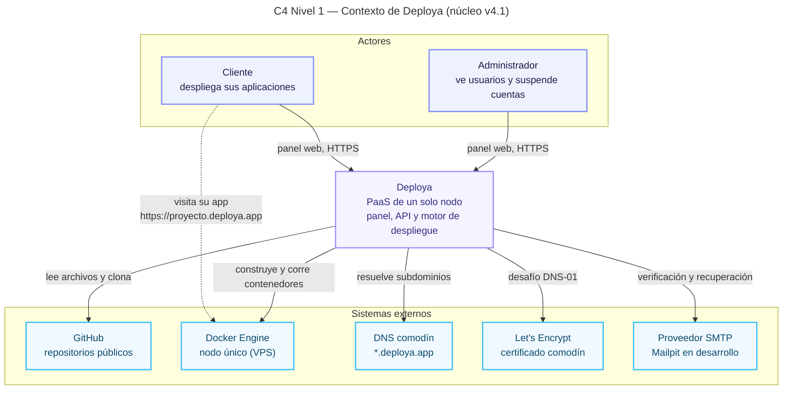
```mermaid
---
title: C4 Nivel 1 — Contexto de Deploya (núcleo v4.1)
---
flowchart TB
    subgraph ACTORES["Actores"]
        CLIENTE["Cliente<br/>despliega sus aplicaciones"]
        ADMIN["Administrador<br/>ve usuarios y suspende cuentas"]
    end

    DEPLOYA["Deploya<br/>PaaS de un solo nodo<br/>panel, API y motor de despliegue"]

    subgraph EXTERNOS["Sistemas externos"]
        GIT["GitHub<br/>repositorios públicos"]
        DOCKER["Docker Engine<br/>nodo único (VPS)"]
        DNS["DNS comodín<br/>*.deploya.app"]
        CA["Let's Encrypt<br/>certificado comodín"]
        CORREO["Proveedor SMTP<br/>Mailpit en desarrollo"]
    end

    CLIENTE -->|"panel web, HTTPS"| DEPLOYA
    ADMIN -->|"panel web, HTTPS"| DEPLOYA
    CLIENTE -.->|"visita su app<br/>https://proyecto.deploya.app"| DOCKER

    DEPLOYA -->|"lee archivos y clona"| GIT
    DEPLOYA -->|"construye y corre contenedores"| DOCKER
    DEPLOYA -->|"resuelve subdominios"| DNS
    DEPLOYA -->|"desafío DNS-01"| CA
    DEPLOYA -->|"verificación y recuperación"| CORREO

    classDef actor fill:#eef2ff,stroke:#818cf8,stroke-width:2px,color:#1e1b4b
    classDef sistema fill:#f5f3ff,stroke:#a78bfa,stroke-width:2px,color:#312e81
    classDef externo fill:#f0f9ff,stroke:#38bdf8,stroke-width:2px,color:#0c4a6e
    class CLIENTE,ADMIN actor
    class DEPLOYA sistema
    class GIT,DOCKER,DNS,CA,CORREO externo
```

### 2.2 Contenedores (nivel 2)

Lo que corre en `docker compose`: web Next.js, API NestJS (produce trabajos, no toca Docker), **worker** con la misma imagen de la API (M4 construye, M5 ejecuta, M6 publica), Redis (BullMQ), PostgreSQL, Traefik v3 con proveedor de archivo y Mailpit. Fuera: Docker Engine, GitHub y el proveedor SMTP del VPS.

<!-- diagrama: docs/diagramas/compartido/c4-contenedores.mmd -->
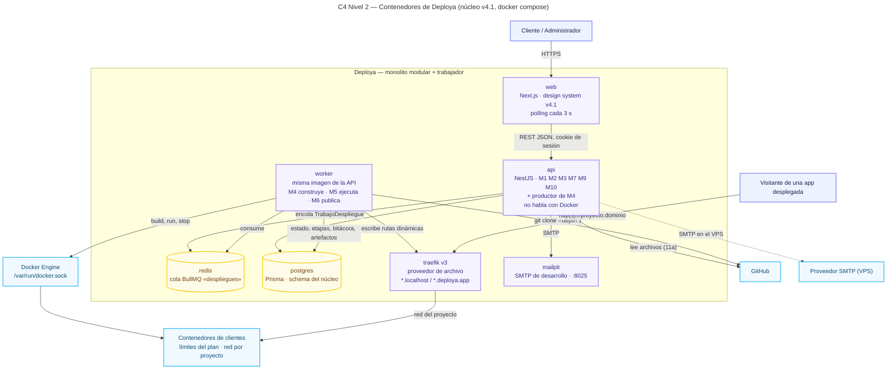
```mermaid
---
title: C4 Nivel 2 — Contenedores de Deploya (núcleo v4.1, docker compose)
---
flowchart TB
    CLIENTE["Cliente / Administrador"]
    VISITANTE["Visitante de una app desplegada"]

    subgraph DEPLOYA["Deploya — monolito modular + trabajador"]
        WEB["web<br/>Next.js · design system v4.1<br/>polling cada 3 s"]
        API["api<br/>NestJS · M1 M2 M3 M7 M9 M10<br/>+ productor de M4<br/>no habla con Docker"]
        WORKER["worker<br/>misma imagen de la API<br/>M4 construye · M5 ejecuta · M6 publica"]
        REDIS[("redis<br/>cola BullMQ «despliegues»")]
        BD[("postgres<br/>Prisma · schema del núcleo")]
        EDGE["traefik v3<br/>proveedor de archivo<br/>*.localhost / *.deploya.app"]
        MAILPIT["mailpit<br/>SMTP de desarrollo · :8025"]
    end

    DOCKER["Docker Engine<br/>/var/run/docker.sock"]
    APPS["Contenedores de clientes<br/>límites del plan · red por proyecto"]
    GIT["GitHub"]
    SMTP["Proveedor SMTP (VPS)"]

    CLIENTE -->|HTTPS| WEB
    WEB -->|"REST JSON, cookie de sesión"| API
    API --> BD
    API -->|"encola TrabajoDespliegue"| REDIS
    API -->|"lee archivos (11a)"| GIT
    API -->|"SMTP"| MAILPIT
    API -.->|"SMTP en el VPS"| SMTP
    WORKER -->|"consume"| REDIS
    WORKER -->|"estado, etapas, bitácora, artefactos"| BD
    WORKER -->|"git clone --depth 1"| GIT
    WORKER -->|"build, run, stop"| DOCKER
    WORKER -->|"escribe rutas dinámicas"| EDGE
    DOCKER --> APPS
    VISITANTE -->|"http(s)://proyecto.dominio"| EDGE
    EDGE -->|"red del proyecto"| APPS

    classDef persona fill:#eef2ff,stroke:#818cf8,stroke-width:2px,color:#1e1b4b
    classDef app fill:#f5f3ff,stroke:#a78bfa,stroke-width:2px,color:#312e81
    classDef data fill:#fefce8,stroke:#facc15,stroke-width:2px,color:#713f12
    classDef ext fill:#f0f9ff,stroke:#38bdf8,stroke-width:2px,color:#0c4a6e
    class CLIENTE,VISITANTE persona
    class WEB,API,WORKER,EDGE,MAILPIT app
    class REDIS,BD data
    class DOCKER,APPS,GIT,SMTP ext
```

### 2.3 Componentes del motor (nivel 3)

Hexagonal: entrada (controladores y el consumidor BullMQ) → aplicación (`ConstruccionService` como Facade, `PipelineDespliegue` con un paso por etapa, `OrquestacionService`, `ReversionService`, `EnrutamientoService`) → dominio puro (`TransicionesDespliegue`, recetas de stack, políticas) → puertos (`abstract class`, sin `I`) → adaptadores (dockerode, git, BullMQ, Prisma, Traefik por archivo), cada uno con su stub.

<!-- diagrama: docs/diagramas/compartido/c4-componentes-motor.mmd -->

```mermaid
---
title: C4 Nivel 3 — Componentes del motor de despliegue (M4 M5 M6), hexagonal
---
flowchart TB
    WEB["web · pantallas 11a, 12, 13, 14"]
    M3["M3 ProyectosService"]
    M2["M2 SuscripcionesService<br/>cuotaDe(usuarioId)"]

    subgraph ENTRADA["Entrada"]
        CTRL["DesplieguesController<br/>POST /proyectos/:id/despliegues<br/>GET /despliegues/:id · /bitacora?desde="]
        CTRL_V2["AccionesController (v2)<br/>reversiones · cancelar · reintentar<br/>reiniciar · detener · artefactos"]
        PROC["ProcesadorDespliegues<br/>consumidor BullMQ (worker)"]
    end

    subgraph APLICACION["Aplicación"]
        CONS["ConstruccionService<br/>Facade exportada: crearDespliegue,<br/>consultar, bitacoraDesde"]
        DETS["DeteccionStackService<br/>exportado a M3"]
        PIPE["PipelineDespliegue<br/>recorre los pasos del plan"]
        ORQ["OrquestacionService<br/>aprovisionar, activar, detener,<br/>detenerTodosDe"]
        REV["ReversionService (v2)<br/>valida y crea el despliegue"]
        ENR["EnrutamientoService<br/>publicar, retirar"]
        RET["RetencionArtefactos<br/>escucha DespliegueTerminado"]
        PASOS["PasoRecepcion · PasoConstruccion<br/>PasoEjecucion · PasoEnrutamiento<br/>PasoOperacion<br/>Chain of Responsibility"]
    end

    subgraph DOMINIO["Dominio puro"]
        TRANS["TransicionesDespliegue<br/>State"]
        RECETAS["RecetaStack (Strategy)<br/>Dockerfile · Node · Python · Go · Estática<br/>decide sobre un mapa de archivos"]
        POL["PoliticaDespliegue<br/>PoliticaRetencion · LimitesContenedor"]
    end

    subgraph PUERTOS["Puertos (abstract class, sin I)"]
        P_COLA["ColaConstruccionPuerto"]
        P_CLON["ClonadorRepositorioPuerto"]
        P_BUILD["ConstructorImagenPuerto"]
        P_LECT["LectorFuente"]
        P_REPO["RepositorioDespliegues<br/>RepositorioArtefactos"]
        P_CONT["ContenedorPuerto"]
        P_SALUD["VerificacionEntornoPuerto"]
        P_RUTA["EnrutamientoPuerto"]
        P_RELOJ["Reloj"]
    end

    subgraph ADAPTADORES["Adaptadores (y un stub por puerto para pruebas)"]
        A_BULL["ColaBullMq"]
        A_GIT["ClonadorGit"]
        A_DBUILD["ConstructorDocker (dockerode)"]
        A_FS["LectorFuenteLocal · LectorFuenteGitHub (M3)"]
        A_PRISMA["RepositorioDesplieguesPrisma"]
        A_DRUN["ContenedorDocker (dockerode)"]
        A_HTTP["VerificacionHttp"]
        A_TRAEFIK["EnrutamientoTraefikArchivo"]
    end

    REDIS[("Redis")]
    PG[("PostgreSQL")]
    DOCKER["Docker Engine"]
    GIT["GitHub"]
    TRAEFIK["Traefik"]

    WEB --> CTRL
    WEB --> CTRL_V2
    M3 --> CONS
    M3 --> DETS
    CTRL --> CONS
    CTRL_V2 --> REV
    CTRL_V2 --> ORQ
    CONS --> M2
    CONS --> TRANS
    CONS --> POL
    CONS --> P_COLA
    CONS --> P_REPO
    REV --> P_REPO
    REV --> P_COLA
    PROC --> PIPE
    PIPE --> PASOS
    PIPE --> TRANS
    PASOS --> P_CLON
    PASOS --> DETS
    PASOS --> P_BUILD
    PASOS --> ORQ
    PASOS --> ENR
    DETS --> RECETAS
    DETS --> P_LECT
    ORQ --> POL
    ORQ --> M2
    ORQ --> P_CONT
    ORQ --> P_SALUD
    ENR --> P_RUTA
    RET --> POL
    RET --> P_CONT
    PIPE --> P_REPO
    PIPE --> P_RELOJ

    P_COLA -.-> A_BULL
    P_CLON -.-> A_GIT
    P_BUILD -.-> A_DBUILD
    P_LECT -.-> A_FS
    P_REPO -.-> A_PRISMA
    P_CONT -.-> A_DRUN
    P_SALUD -.-> A_HTTP
    P_RUTA -.-> A_TRAEFIK

    A_BULL --> REDIS
    A_PRISMA --> PG
    A_GIT --> GIT
    A_DBUILD --> DOCKER
    A_DRUN --> DOCKER
    A_TRAEFIK --> TRAEFIK

    classDef entry fill:#eef2ff,stroke:#818cf8,stroke-width:2px,color:#1e1b4b
    classDef app fill:#f5f3ff,stroke:#a78bfa,stroke-width:2px,color:#312e81
    classDef dom fill:#f0fdf4,stroke:#4ade80,stroke-width:2px,color:#166534
    classDef port fill:#fff7ed,stroke:#fb923c,stroke-width:2px,color:#7c2d12
    classDef adapter fill:#fdf4ff,stroke:#e879f9,stroke-width:2px,color:#701a75
    classDef ext fill:#f0f9ff,stroke:#38bdf8,stroke-width:2px,color:#0c4a6e
    class CTRL,CTRL_V2,PROC entry
    class CONS,DETS,PIPE,ORQ,REV,ENR,RET,PASOS app
    class TRANS,RECETAS,POL dom
    class P_COLA,P_CLON,P_BUILD,P_LECT,P_REPO,P_CONT,P_SALUD,P_RUTA,P_RELOJ port
    class A_BULL,A_GIT,A_DBUILD,A_FS,A_PRISMA,A_DRUN,A_HTTP,A_TRAEFIK adapter
    class WEB,M3,M2,REDIS,PG,DOCKER,GIT,TRAEFIK ext
```

### 2.4 Módulos Nest del motor (qué exporta cada uno)

Dos procesos con la misma imagen: `main.ts` (API) y `trabajador.ts` (worker). `AdaptersModule` es el único lugar que elige entre adaptadores reales y stubs (`MOTOR_ADAPTADORES`).

<!-- diagrama: docs/diagramas/m1-m10/m4-m5-m6-componentes.mmd -->
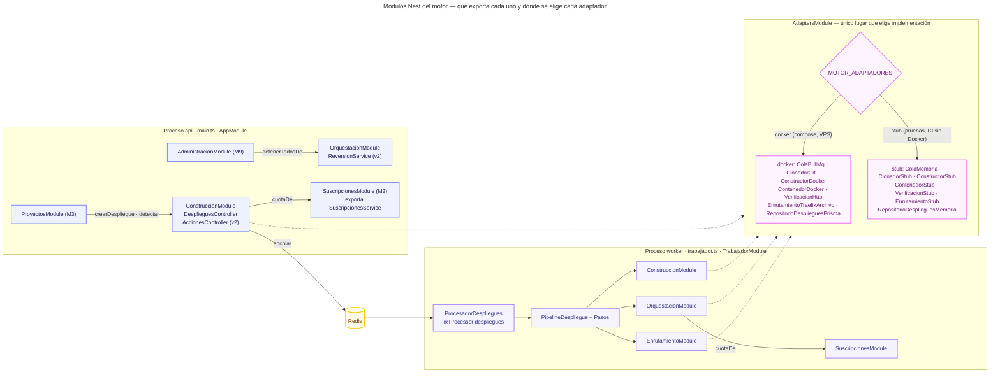
```mermaid
---
title: Módulos Nest del motor — qué exporta cada uno y dónde se elige cada adaptador
---
flowchart LR
    subgraph PROCESO_API["Proceso api · main.ts · AppModule"]
        PM3["ProyectosModule (M3)"]
        PM9["AdministracionModule (M9)"]
        CM_API["ConstruccionModule<br/>DesplieguesController<br/>AccionesController (v2)"]
        OM_API["OrquestacionModule<br/>ReversionService (v2)"]
        SM["SuscripcionesModule (M2)<br/>exporta SuscripcionesService"]
    end

    subgraph PROCESO_WORKER["Proceso worker · trabajador.ts · TrabajadorModule"]
        PROC["ProcesadorDespliegues<br/>@Processor despliegues"]
        PIPE["PipelineDespliegue + Pasos"]
        CM_W["ConstruccionModule"]
        OM_W["OrquestacionModule"]
        EM_W["EnrutamientoModule"]
        SM_W["SuscripcionesModule"]
    end

    subgraph ADAPT["AdaptersModule — único lugar que elige implementación"]
        BIND{"MOTOR_ADAPTADORES"}
        REAL["docker: ColaBullMq · ClonadorGit · ConstructorDocker<br/>ContenedorDocker · VerificacionHttp<br/>EnrutamientoTraefikArchivo · RepositorioDesplieguesPrisma"]
        STUB["stub: ColaMemoria · ClonadorStub · ConstructorStub<br/>ContenedorStub · VerificacionStub · EnrutamientoStub<br/>RepositorioDesplieguesMemoria"]
    end

    PM3 -->|"crearDespliegue · detectar"| CM_API
    PM9 -->|"detenerTodosDe"| OM_API
    CM_API -->|"cuotaDe"| SM
    CM_API -->|"encolar"| REDIS[("Redis")]
    REDIS --> PROC
    PROC --> PIPE
    PIPE --> CM_W
    PIPE --> OM_W
    PIPE --> EM_W
    OM_W -->|"cuotaDe"| SM_W
    BIND -->|"docker (compose, VPS)"| REAL
    BIND -->|"stub (pruebas, CI sin Docker)"| STUB
    CM_API -.-> ADAPT
    CM_W -.-> ADAPT
    OM_W -.-> ADAPT
    EM_W -.-> ADAPT

    classDef api fill:#eef2ff,stroke:#818cf8,stroke-width:2px,color:#1e1b4b
    classDef worker fill:#f5f3ff,stroke:#a78bfa,stroke-width:2px,color:#312e81
    classDef adapt fill:#fdf4ff,stroke:#e879f9,stroke-width:2px,color:#701a75
    classDef data fill:#fefce8,stroke:#facc15,stroke-width:2px,color:#713f12
    class PM3,PM9,CM_API,OM_API,SM api
    class PROC,PIPE,CM_W,OM_W,EM_W,SM_W worker
    class BIND,REAL,STUB adapt
    class REDIS data
```

### 2.5 Despliegue en el nodo (compose, redes y volúmenes)

Una red por proyecto (`deploya-p-<subdominio>`); el worker conecta a ella a Traefik y a sí mismo para la verificación de salud. Traefik lee rutas de un volumen compartido que escribe el worker ([ADR 0005](adr/0005-traefik-proveedor-de-archivo.md)).

<!-- diagrama: docs/diagramas/compartido/despliegue-infraestructura.mmd -->
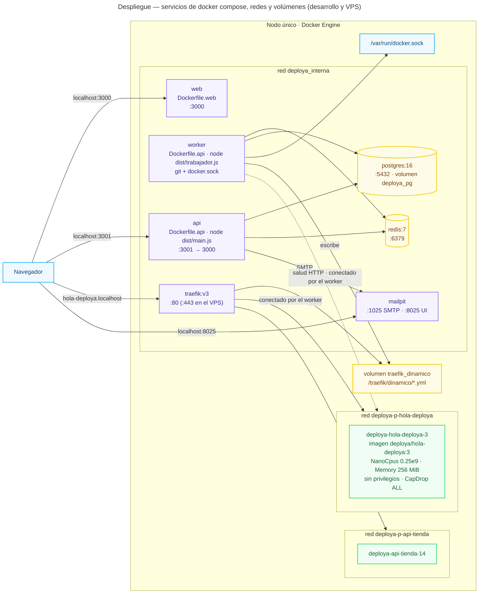
```mermaid
---
title: Despliegue — servicios de docker compose, redes y volúmenes (desarrollo y VPS)
---
flowchart LR
    subgraph HOST["Nodo único · Docker Engine"]
        subgraph RED_INTERNA["red deploya_interna"]
            PG[("postgres:16<br/>:5432 · volumen deploya_pg")]
            RD[("redis:7<br/>:6379")]
            API["api<br/>Dockerfile.api · node dist/main.js<br/>:3001 → 3000"]
            WK["worker<br/>Dockerfile.api · node dist/trabajador.js<br/>git + docker.sock"]
            WEB["web<br/>Dockerfile.web<br/>:3000"]
            MP["mailpit<br/>:1025 SMTP · :8025 UI"]
            TR["traefik:v3<br/>:80 (:443 en el VPS)"]
        end

        subgraph RED_P1["red deploya-p-hola-deploya"]
            C1["deploya-hola-deploya-3<br/>imagen deploya/hola-deploya:3<br/>NanoCpus 0.25e9 · Memory 256 MiB<br/>sin privilegios · CapDrop ALL"]
        end

        subgraph RED_P2["red deploya-p-api-tienda"]
            C2["deploya-api-tienda-14"]
        end

        SOCK["/var/run/docker.sock"]
        VOL["volumen traefik_dinamico<br/>/traefik/dinamico/*.yml"]
    end

    NAV["Navegador"]

    NAV -->|"localhost:3000"| WEB
    NAV -->|"localhost:3001"| API
    NAV -->|"hola-deploya.localhost"| TR
    NAV -->|"localhost:8025"| MP
    API --> PG
    API --> RD
    API -->|SMTP| MP
    WK --> RD
    WK --> PG
    WK --> SOCK
    WK -->|escribe| VOL
    TR -->|"vigila"| VOL
    TR -->|"conectado por el worker"| RED_P1
    TR --> RED_P2
    WK -.->|"salud HTTP · conectado por el worker"| RED_P1

    classDef data fill:#fefce8,stroke:#facc15,stroke-width:2px,color:#713f12
    classDef app fill:#f5f3ff,stroke:#a78bfa,stroke-width:2px,color:#312e81
    classDef cliente fill:#f0fdf4,stroke:#4ade80,stroke-width:2px,color:#166534
    classDef ext fill:#f0f9ff,stroke:#38bdf8,stroke-width:2px,color:#0c4a6e
    class PG,RD,VOL data
    class API,WK,WEB,MP,TR app
    class C1,C2 cliente
    class SOCK,NAV ext
```

---

## 3. Capa de herramientas M8 (§9.3, §10.3)

Derek integra M4–M6 **y** la capa de herramientas de M8. Misma superficie para el asistente del panel y para clientes externos. Hereda permisos del usuario; operaciones destructivas piden confirmación humana; bitácoras y repositorios son entrada no confiable.

<!-- diagrama: docs/diagramas/m1-m10/m8-herramientas-componentes.mmd -->
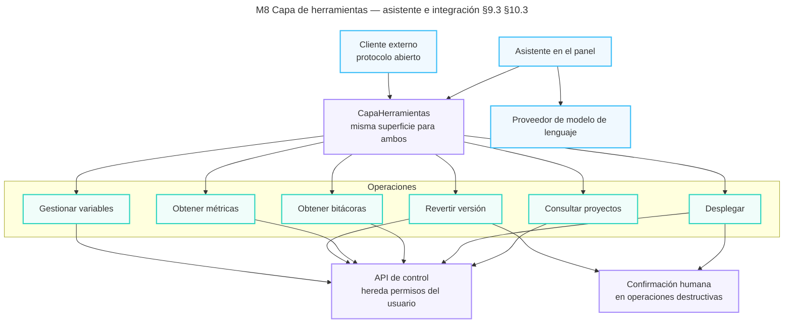
```mermaid
---
title: M8 Capa de herramientas — asistente e integración §9.3 §10.3
---
flowchart TB
    PANEL["Asistente en el panel"]
    EXT["Cliente externo<br/>protocolo abierto"]

    HERR["CapaHerramientas<br/>misma superficie para ambos"]

    subgraph OPS["Operaciones"]
        OP1["Consultar proyectos"]
        OP2["Desplegar"]
        OP3["Obtener bitácoras"]
        OP4["Obtener métricas"]
        OP5["Revertir versión"]
        OP6["Gestionar variables"]
    end

    API["API de control<br/>hereda permisos del usuario"]
    LLM["Proveedor de modelo de lenguaje"]
    CONF["Confirmación humana<br/>en operaciones destructivas"]

    PANEL --> HERR
    EXT --> HERR
    PANEL --> LLM
    HERR --> OP1
    HERR --> OP2
    HERR --> OP3
    HERR --> OP4
    HERR --> OP5
    HERR --> OP6
    OP1 --> API
    OP2 --> API
    OP3 --> API
    OP4 --> API
    OP5 --> API
    OP6 --> API
    OP2 --> CONF
    OP5 --> CONF

    classDef ext fill:#f0f9ff,stroke:#38bdf8,stroke-width:2px
    classDef core fill:#f5f3ff,stroke:#a78bfa,stroke-width:2px
    classDef op fill:#f0fdfa,stroke:#2dd4bf,stroke-width:2px
    class PANEL,EXT,LLM ext
    class HERR,API,CONF core
    class OP1,OP2,OP3,OP4,OP5,OP6 op
```

---

## 4. UML por módulo (compañeros, ya corregido)

Los `.mmd` originales no se borran. Aquí va la versión pulida de clases (sin `I`) y el resto de diagramas de compañeros tal cual, salvo que el original ya estaba limpio.

### 4.1 M1 Identidad y acceso + M10 Notificaciones

#### Casos de uso de autenticación

<!-- diagrama: docs/diagramas/m1-m10/m1-m10-casos-de-uso-autenticacion.mmd -->

```mermaid
---
config:
  layout: fixed
---
flowchart LR
 subgraph DEPLOYA["Deploya"]
        REG(("Registrarse"))
        VERIFY(("Verificar correo"))
        LOGIN(("Iniciar sesión"))
        LOGOUT(("Cerrar sesión"))
        RECOVERY(("Recuperar contraseña"))
        RESET(("Restablecer contraseña"))
        PROFILE(("Consultar perfil"))
        SESSION(("Gestionar sesiones"))
        ACCESS(("Acceder según rol"))
        VALID_REG(("Validar datos de registro"))
        SEND_VERIFY(("Enviar correo de verificación"))
        VALID_TOKEN_VERIFY(("Validar token de verificación"))
        VALID_CREDENTIALS(("Validar credenciales"))
        CREATE_SESSION(("Crear sesión"))
        VALID_PERMISSION(("Validar permisos"))
        GENERATE_RESET(("Generar token de recuperación"))
        SEND_RESET(("Enviar enlace de recuperación"))
        VALID_RESET_TOKEN(("Validar token de recuperación"))
        UPDATE_PASSWORD(("Actualizar contraseña"))
        AUDIT(("Registrar evento de auditoría"))
        RESEND_VERIFY(("Reenviar correo de verificación"))
        NEW_RECOVERY(("Solicitar nuevo enlace de recuperación"))
  end
    CLIENTE["👤 Cliente"] --- REG & VERIFY & LOGIN & LOGOUT & RECOVERY & RESET & PROFILE & SESSION & ACCESS
    ADMIN["👤 Administrador"] --- LOGIN & LOGOUT & SESSION & ACCESS
    OPERADOR["👤 Operador de infraestructura"] --- LOGIN & LOGOUT & SESSION & ACCESS
    SOPORTE["👤 Soporte técnico"] --- LOGIN & LOGOUT & SESSION & ACCESS
    REG -. include .-> VALID_REG & SEND_VERIFY & AUDIT
    VERIFY -. include .-> VALID_TOKEN_VERIFY & AUDIT
    LOGIN -. include .-> VALID_CREDENTIALS & CREATE_SESSION & AUDIT
    LOGOUT -. include .-> AUDIT
    ACCESS -. include .-> VALID_PERMISSION
    RECOVERY -. include .-> GENERATE_RESET & SEND_RESET & AUDIT
    RESET -. include .-> VALID_RESET_TOKEN & UPDATE_PASSWORD & AUDIT
    RESEND_VERIFY -. extend .-> VERIFY
    NEW_RECOVERY -. extend .-> RECOVERY

    linkStyle 0 stroke:#FFD600,fill:none
    linkStyle 1 stroke:#FFD600,fill:none
    linkStyle 2 stroke:#FFD600,fill:none
    linkStyle 3 stroke:#FFD600,fill:none
    linkStyle 4 stroke:#FFD600,fill:none
    linkStyle 5 stroke:#FFD600,fill:none
    linkStyle 6 stroke:#FFD600,fill:none
    linkStyle 7 stroke:#FFD600,fill:none
    linkStyle 8 stroke:#FFD600,fill:none
    linkStyle 9 stroke:#FF6D00,fill:none
    linkStyle 10 stroke:#FF6D00,fill:none
    linkStyle 11 stroke:#FF6D00,fill:none
    linkStyle 12 stroke:#FF6D00,fill:none
    linkStyle 13 stroke:#00C853,fill:none
    linkStyle 14 stroke:#00C853,fill:none
    linkStyle 15 stroke:#00C853,fill:none
    linkStyle 16 stroke:#00C853,fill:none
    linkStyle 17 stroke:#2962FF,fill:none
    linkStyle 18 stroke:#2962FF,fill:none
    linkStyle 19 stroke:#2962FF,fill:none
    linkStyle 20 stroke:#2962FF
```

#### Componentes M1 + M10

El puerto de correo ya no lleva prefijo `I`. En el unificado se nombra `CorreoPuerto`.

<!-- diagrama: docs/diagramas/m1-m10/m1-m10-componentes.mmd -->
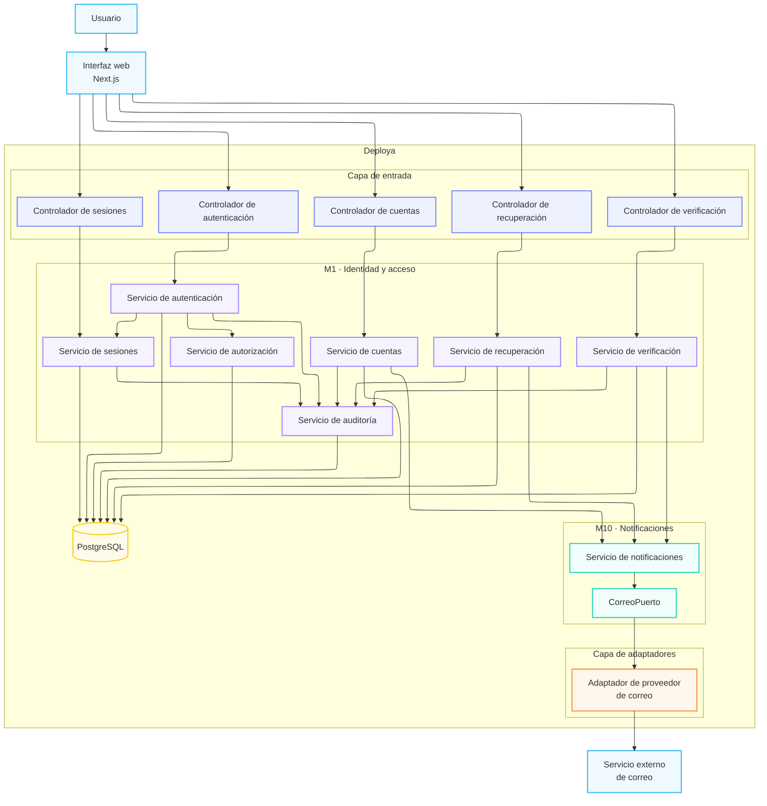
```mermaid
---
config:
  layout: elk
---
flowchart TB
    USER["Usuario"] --> UI["Interfaz web<br/>Next.js"]

    subgraph DEPLOYA["Deploya"]
        direction TB

        subgraph API["Capa de entrada"]
            direction LR
            ACCOUNT_CTRL["Controlador de cuentas"]
            AUTH_CTRL["Controlador de autenticación"]
            SESSION_CTRL["Controlador de sesiones"]
            RECOVERY_CTRL["Controlador de recuperación"]
            VERIFY_CTRL["Controlador de verificación"]
        end

        subgraph M1["M1 · Identidad y acceso"]
            direction TB
            ACCOUNT["Servicio de cuentas"]
            AUTH["Servicio de autenticación"]
            SESSION["Servicio de sesiones"]
            AUTHZ["Servicio de autorización"]
            RECOVERY["Servicio de recuperación"]
            VERIFY["Servicio de verificación"]
            AUDIT["Servicio de auditoría"]
        end

        subgraph M10["M10 · Notificaciones"]
            direction TB
            NOTIFICATION["Servicio de notificaciones"]
            CORREO_PUERTO["CorreoPuerto"]
        end

        subgraph ADAPTERS["Capa de adaptadores"]
            direction TB
            EMAIL_ADAPTER["Adaptador de proveedor<br/>de correo"]
        end

        DB[("PostgreSQL")]
    end

    EMAIL["Servicio externo<br/>de correo"]

    UI --> ACCOUNT_CTRL
    UI --> AUTH_CTRL
    UI --> SESSION_CTRL
    UI --> RECOVERY_CTRL
    UI --> VERIFY_CTRL

    ACCOUNT_CTRL --> ACCOUNT
    AUTH_CTRL --> AUTH
    SESSION_CTRL --> SESSION
    RECOVERY_CTRL --> RECOVERY
    VERIFY_CTRL --> VERIFY

    AUTH --> SESSION
    AUTH --> AUTHZ

    ACCOUNT --> AUDIT
    AUTH --> AUDIT
    SESSION --> AUDIT
    RECOVERY --> AUDIT
    VERIFY --> AUDIT

    ACCOUNT --> DB
    AUTH --> DB
    SESSION --> DB
    AUTHZ --> DB
    RECOVERY --> DB
    VERIFY --> DB
    AUDIT --> DB

    ACCOUNT --> NOTIFICATION
    VERIFY --> NOTIFICATION
    RECOVERY --> NOTIFICATION

    NOTIFICATION --> CORREO_PUERTO
    CORREO_PUERTO --> EMAIL_ADAPTER
    EMAIL_ADAPTER --> EMAIL

    classDef external fill:#f0f9ff,stroke:#38bdf8,stroke-width:2px;
    classDef entry fill:#eef2ff,stroke:#818cf8,stroke-width:2px;
    classDef identity fill:#f5f3ff,stroke:#a78bfa,stroke-width:2px;
    classDef notification fill:#f0fdfa,stroke:#2dd4bf,stroke-width:2px;
    classDef adapter fill:#fff7ed,stroke:#fb923c,stroke-width:2px;
    classDef data fill:#fefce8,stroke:#facc15,stroke-width:2px;

    class USER,UI,EMAIL external;
    class ACCOUNT_CTRL,AUTH_CTRL,SESSION_CTRL,RECOVERY_CTRL,VERIFY_CTRL entry;
    class ACCOUNT,AUTH,SESSION,AUTHZ,RECOVERY,VERIFY,AUDIT identity;
    class NOTIFICATION,CORREO_PUERTO notification;
    class EMAIL_ADAPTER adapter;
    class DB data;
```

#### Actividad: registro

<!-- diagrama: docs/diagramas/m1-m10/m1-actividad-registro.mmd -->
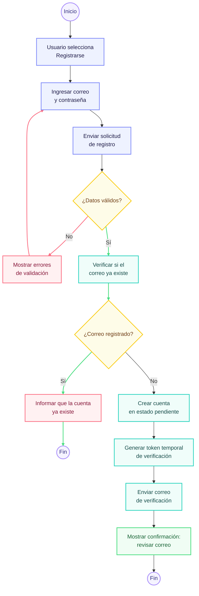
```mermaid
---
config:
  layout: fixed
---
flowchart TB
    START(("Inicio")) --> A["Usuario selecciona<br>Registrarse"]
    A --> B["Ingresar correo<br>y contraseña"]
    B --> C["Enviar solicitud<br>de registro"]
    C --> D{"¿Datos válidos?"}
    D -- No --> E["Mostrar errores<br>de validación"]
    E --> B
    D -- Sí --> F["Verificar si el<br>correo ya existe"]
    F --> G{"¿Correo registrado?"}
    G -- Sí --> H["Informar que la cuenta<br>ya existe"]
    H --> END1(("Fin"))
    G -- No --> I["Crear cuenta<br>en estado pendiente"]
    I --> J["Generar token temporal<br>de verificación"]
    J --> K["Enviar correo<br>de verificación"]
    K --> L["Mostrar confirmación:<br>revisar correo"]
    L --> END2(("Fin"))

     START:::startEnd
     A:::input
     B:::input
     C:::input
     D:::decision
     E:::error
     F:::process
     G:::decision
     H:::error
     END1:::startEnd
     I:::process
     J:::process
     K:::process
     L:::success
     END2:::startEnd
    classDef startEnd fill:#f5f3ff,stroke:#a78bfa,stroke-width:2px,color:#312e81
    classDef input fill:#eef2ff,stroke:#818cf8,stroke-width:2px,color:#1e1b4b
    classDef process fill:#f0fdfa,stroke:#2dd4bf,stroke-width:2px,color:#134e4a
    classDef decision fill:#fefce8,stroke:#facc15,stroke-width:2px,color:#713f12
    classDef error fill:#fff1f2,stroke:#fb7185,stroke-width:2px,color:#881337
    classDef success fill:#f0fdf4,stroke:#4ade80,stroke-width:2px,color:#166534
    linkStyle 4 stroke:#fb7185,stroke-width:2px,fill:none
    linkStyle 5 stroke:#fb7185,stroke-width:2px,fill:none
    linkStyle 6 stroke:#4ade80,stroke-width:2px,fill:none
    linkStyle 7 stroke:#4ade80,stroke-width:2px,fill:none
    linkStyle 8 stroke:#4ade80,stroke-width:2px,fill:none
    linkStyle 9 stroke:#4ade80,stroke-width:2px,fill:none
```

#### Actividad: verificación de correo

<!-- diagrama: docs/diagramas/m1-m10/m1-actividad-verificacion-correo.mmd -->
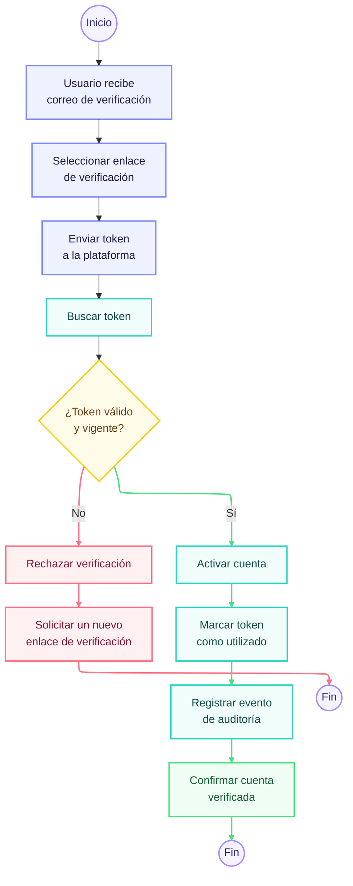
```mermaid
---
config:
  layout: elk
---
flowchart TD

    START((Inicio))

    A["Usuario recibe<br/>correo de verificación"]
    B["Seleccionar enlace<br/>de verificación"]
    C["Enviar token<br/>a la plataforma"]

    D["Buscar token"]
    E{"¿Token válido<br/>y vigente?"}

    F["Rechazar verificación"]
    G["Solicitar un nuevo<br/>enlace de verificación"]

    H["Activar cuenta"]
    I["Marcar token<br/>como utilizado"]
    J["Registrar evento<br/>de auditoría"]
    K["Confirmar cuenta<br/>verificada"]

    END1((Fin))
    END2((Fin))

    START --> A
    A --> B
    B --> C
    C --> D
    D --> E

    E -->|"No"| F
    F --> G
    G --> END1

    E -->|"Sí"| H
    H --> I
    I --> J
    J --> K
    K --> END2

    classDef startEnd fill:#f5f3ff,stroke:#a78bfa,stroke-width:2px,color:#312e81;
    classDef input fill:#eef2ff,stroke:#818cf8,stroke-width:2px,color:#1e1b4b;
    classDef process fill:#f0fdfa,stroke:#2dd4bf,stroke-width:2px,color:#134e4a;
    classDef decision fill:#fefce8,stroke:#facc15,stroke-width:2px,color:#713f12;
    classDef error fill:#fff1f2,stroke:#fb7185,stroke-width:2px,color:#881337;
    classDef success fill:#f0fdf4,stroke:#4ade80,stroke-width:2px,color:#166534;

    class START,END1,END2 startEnd;
    class A,B,C input;
    class D,H,I,J process;
    class E decision;
    class F,G error;
    class K success;

    linkStyle 5,6,7 stroke:#fb7185,stroke-width:2px;
    linkStyle 8,9,10,11,12 stroke:#4ade80,stroke-width:2px;
```

#### Actividad: recuperación de contraseña

<!-- diagrama: docs/diagramas/m1-m10/m1-actividad-recuperacion-contrasena.mmd -->
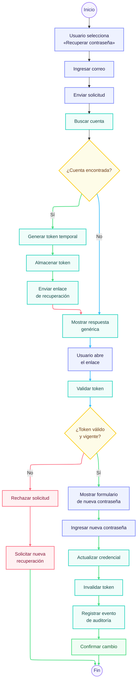
```mermaid
---
config:
  layout: elk
---
flowchart TD

    START((Inicio))

    A["Usuario selecciona<br/>«Recuperar contraseña»"]
    B["Ingresar correo"]
    C["Enviar solicitud"]
    D["Buscar cuenta"]

    E{"¿Cuenta encontrada?"}

    F["Generar token temporal"]
    G["Almacenar token"]
    H["Enviar enlace<br/>de recuperación"]
    I["Mostrar respuesta<br/>genérica"]

    J["Usuario abre<br/>el enlace"]
    K["Validar token"]

    L{"¿Token válido<br/>y vigente?"}

    M["Rechazar solicitud"]
    N["Solicitar nueva<br/>recuperación"]

    O["Mostrar formulario<br/>de nueva contraseña"]
    P["Ingresar nueva contraseña"]
    Q["Actualizar credencial"]
    R["Invalidar token"]
    S["Registrar evento<br/>de auditoría"]
    T["Confirmar cambio"]

    END((Fin))

    START --> A
    A --> B
    B --> C
    C --> D
    D --> E

    E -->|"No"| I
    I --> J
    J --> K
    K --> L

    E -->|"Sí"| F
    F --> G
    G --> H
    H --> I

    L -->|"No"| M
    M --> N
    N --> END

    L -->|"Sí"| O
    O --> P
    P --> Q
    Q --> R
    R --> S
    S --> T
    T --> END

    classDef startEnd fill:#f5f3ff,stroke:#a78bfa,stroke-width:2px,color:#312e81;
    classDef userAction fill:#eef2ff,stroke:#818cf8,stroke-width:2px,color:#1e1b4b;
    classDef systemProcess fill:#f0fdfa,stroke:#2dd4bf,stroke-width:2px,color:#134e4a;
    classDef decision fill:#fefce8,stroke:#facc15,stroke-width:2px,color:#713f12;
    classDef error fill:#fff1f2,stroke:#fb7185,stroke-width:2px,color:#881337;
    classDef success fill:#f0fdf4,stroke:#4ade80,stroke-width:2px,color:#166534;

    class START,END startEnd;
    class A,B,C,J,O,P userAction;
    class D,F,G,H,I,K,Q,R,S systemProcess;
    class E,L decision;
    class M,N error;
    class T success;

    linkStyle 5,6,7,8 stroke:#38bdf8,stroke-width:2px;
    linkStyle 9,10,11 stroke:#4ade80,stroke-width:2px;
    linkStyle 12,13,14 stroke:#fb7185,stroke-width:2px;
    linkStyle 15,16,17,18,19,20,21,22 stroke:#4ade80,stroke-width:2px;
```

### 4.2 M2 Suscripciones y pagos + M9 Administración

#### Componentes M2 + M9

<!-- diagrama: docs/diagramas/m1-m10/m2-m9-componentes.mmd -->
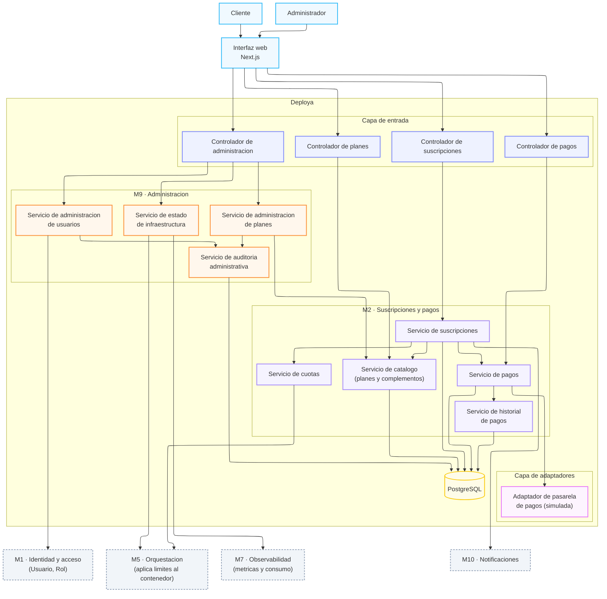
```mermaid
---
config:
  layout: elk
---
flowchart TB
    USER["Cliente"] --> UI["Interfaz web<br/>Next.js"]
    ADMIN_USER["Administrador"] --> UI

    subgraph DEPLOYA["Deploya"]
        direction TB

        subgraph API["Capa de entrada"]
            direction LR
            PLAN_CTRL["Controlador de planes"]
            SUB_CTRL["Controlador de suscripciones"]
            PAY_CTRL["Controlador de pagos"]
            ADMIN_CTRL["Controlador de administracion"]
        end

        subgraph M2["M2 · Suscripciones y pagos"]
            direction TB
            CATALOGO["Servicio de catalogo<br/>(planes y complementos)"]
            SUSCRIPCION["Servicio de suscripciones"]
            PAGOS["Servicio de pagos"]
            CUOTAS["Servicio de cuotas"]
            HISTORIAL["Servicio de historial<br/>de pagos"]
        end

        subgraph M9["M9 · Administracion"]
            direction TB
            ADMIN_USUARIOS["Servicio de administracion<br/>de usuarios"]
            ADMIN_PLANES["Servicio de administracion<br/>de planes"]
            ADMIN_INFRA["Servicio de estado<br/>de infraestructura"]
            ADMIN_AUDIT["Servicio de auditoria<br/>administrativa"]
        end

        subgraph ADAPTERS["Capa de adaptadores"]
            direction TB
            PAY_ADAPTER["Adaptador de pasarela<br/>de pagos (simulada)"]
        end

        DB[("PostgreSQL")]
    end

    M1_USUARIO["M1 · Identidad y acceso<br/>(Usuario, Rol)"]
    M5_ORQUESTA["M5 · Orquestacion<br/>(aplica limites al contenedor)"]
    M7_OBSERVA["M7 · Observabilidad<br/>(metricas y consumo)"]
    M10_NOTIF["M10 · Notificaciones"]

    UI --> PLAN_CTRL
    UI --> SUB_CTRL
    UI --> PAY_CTRL
    UI --> ADMIN_CTRL

    PLAN_CTRL --> CATALOGO
    SUB_CTRL --> SUSCRIPCION
    PAY_CTRL --> PAGOS
    ADMIN_CTRL --> ADMIN_USUARIOS
    ADMIN_CTRL --> ADMIN_PLANES
    ADMIN_CTRL --> ADMIN_INFRA

    SUSCRIPCION --> CATALOGO
    SUSCRIPCION --> CUOTAS
    SUSCRIPCION --> PAGOS
    PAGOS --> HISTORIAL
    PAGOS --> PAY_ADAPTER

    ADMIN_PLANES --> CATALOGO
    ADMIN_USUARIOS --> M1_USUARIO
    ADMIN_INFRA --> M5_ORQUESTA
    ADMIN_INFRA --> M7_OBSERVA

    CUOTAS --> M5_ORQUESTA
    SUSCRIPCION --> M10_NOTIF
    ADMIN_PLANES --> ADMIN_AUDIT
    ADMIN_USUARIOS --> ADMIN_AUDIT

    CATALOGO --> DB
    SUSCRIPCION --> DB
    PAGOS --> DB
    HISTORIAL --> DB
    ADMIN_AUDIT --> DB

    classDef external fill:#f0f9ff,stroke:#38bdf8,stroke-width:2px;
    classDef entry fill:#eef2ff,stroke:#818cf8,stroke-width:2px;
    classDef suscripciones fill:#f5f3ff,stroke:#a78bfa,stroke-width:2px;
    classDef administracion fill:#fff7ed,stroke:#fb923c,stroke-width:2px;
    classDef adapter fill:#fdf4ff,stroke:#e879f9,stroke-width:2px;
    classDef data fill:#fefce8,stroke:#facc15,stroke-width:2px;
    classDef otromodulo fill:#f1f5f9,stroke:#94a3b8,stroke-width:2px,stroke-dasharray: 4 3;

    class USER,ADMIN_USER,UI external;
    class PLAN_CTRL,SUB_CTRL,PAY_CTRL,ADMIN_CTRL entry;
    class CATALOGO,SUSCRIPCION,PAGOS,CUOTAS,HISTORIAL suscripciones;
    class ADMIN_USUARIOS,ADMIN_PLANES,ADMIN_INFRA,ADMIN_AUDIT administracion;
    class PAY_ADAPTER adapter;
    class DB data;
    class M1_USUARIO,M5_ORQUESTA,M7_OBSERVA,M10_NOTIF otromodulo;
```

#### Clases M2 + M9 (pulido: `IPasarelaPago` → `PasarelaPago`)

<!-- diagrama: docs/diagramas/m1-m10/m2-m9-clases.mmd -->
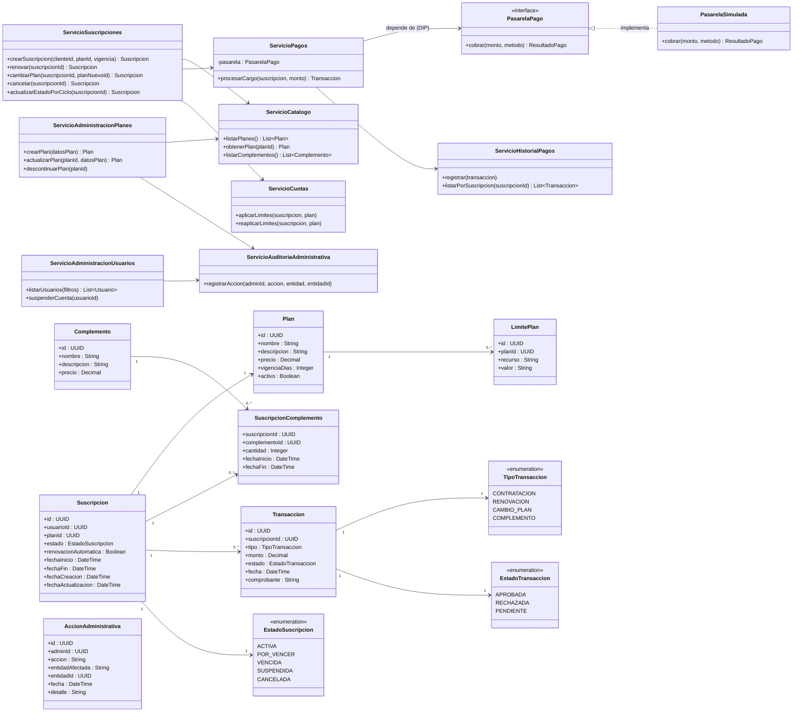
```mermaid
classDiagram
    direction LR

    class ServicioCatalogo {
        +listarPlanes() List~Plan~
        +obtenerPlan(planId) Plan
        +listarComplementos() List~Complemento~
    }

    class ServicioSuscripciones {
        +crearSuscripcion(clienteId, planId, vigencia) Suscripcion
        +renovar(suscripcionId) Suscripcion
        +cambiarPlan(suscripcionId, planNuevoId) Suscripcion
        +cancelar(suscripcionId) Suscripcion
        +actualizarEstadoPorCiclo(suscripcionId) Suscripcion
    }

    class ServicioPagos {
        -pasarela : PasarelaPago
        +procesarCargo(suscripcion, monto) Transaccion
    }

    class PasarelaPago {
        <<interface>>
        +cobrar(monto, metodo) ResultadoPago
    }

    class PasarelaSimulada {
        +cobrar(monto, metodo) ResultadoPago
    }

    class ServicioCuotas {
        +aplicarLimites(suscripcion, plan)
        +reaplicarLimites(suscripcion, plan)
    }

    class ServicioHistorialPagos {
        +registrar(transaccion)
        +listarPorSuscripcion(suscripcionId) List~Transaccion~
    }

    class ServicioAdministracionPlanes {
        +crearPlan(datosPlan) Plan
        +actualizarPlan(planId, datosPlan) Plan
        +descontinuarPlan(planId)
    }

    class ServicioAdministracionUsuarios {
        +listarUsuarios(filtros) List~Usuario~
        +suspenderCuenta(usuarioId)
    }

    class ServicioAuditoriaAdministrativa {
        +registrarAccion(adminId, accion, entidad, entidadId)
    }

    class Plan {
        +id : UUID
        +nombre : String
        +descripcion : String
        +precio : Decimal
        +vigenciaDias : Integer
        +activo : Boolean
    }

    class LimitePlan {
        +id : UUID
        +planId : UUID
        +recurso : String
        +valor : String
    }

    class Complemento {
        +id : UUID
        +nombre : String
        +descripcion : String
        +precio : Decimal
    }

    class Suscripcion {
        +id : UUID
        +usuarioId : UUID
        +planId : UUID
        +estado : EstadoSuscripcion
        +renovacionAutomatica : Boolean
        +fechaInicio : DateTime
        +fechaFin : DateTime
        +fechaCreacion : DateTime
        +fechaActualizacion : DateTime
    }

    class SuscripcionComplemento {
        +suscripcionId : UUID
        +complementoId : UUID
        +cantidad : Integer
        +fechaInicio : DateTime
        +fechaFin : DateTime
    }

    class Transaccion {
        +id : UUID
        +suscripcionId : UUID
        +tipo : TipoTransaccion
        +monto : Decimal
        +estado : EstadoTransaccion
        +fecha : DateTime
        +comprobante : String
    }

    class AccionAdministrativa {
        +id : UUID
        +adminId : UUID
        +accion : String
        +entidadAfectada : String
        +entidadId : UUID
        +fecha : DateTime
        +detalle : String
    }

    class EstadoSuscripcion {
        <<enumeration>>
        ACTIVA
        POR_VENCER
        VENCIDA
        SUSPENDIDA
        CANCELADA
    }

    class TipoTransaccion {
        <<enumeration>>
        CONTRATACION
        RENOVACION
        CAMBIO_PLAN
        COMPLEMENTO
    }

    class EstadoTransaccion {
        <<enumeration>>
        APROBADA
        RECHAZADA
        PENDIENTE
    }

    PasarelaPago <|.. PasarelaSimulada : implementa
    ServicioPagos --> PasarelaPago : depende de (DIP)
    ServicioSuscripciones --> ServicioCatalogo
    ServicioSuscripciones --> ServicioPagos
    ServicioSuscripciones --> ServicioCuotas
    ServicioPagos --> ServicioHistorialPagos
    ServicioAdministracionPlanes --> ServicioCatalogo
    ServicioAdministracionPlanes --> ServicioAuditoriaAdministrativa
    ServicioAdministracionUsuarios --> ServicioAuditoriaAdministrativa

    Plan "1" --> "0..*" LimitePlan
    Suscripcion "1" --> "1" Plan
    Suscripcion "1" --> "0..*" SuscripcionComplemento
    Complemento "1" --> "0..*" SuscripcionComplemento
    Suscripcion "1" --> "0..*" Transaccion
    Suscripcion "1" --> "1" EstadoSuscripcion
    Transaccion "1" --> "1" TipoTransaccion
    Transaccion "1" --> "1" EstadoTransaccion
```

#### Secuencia: contratación de plan

<!-- diagrama: docs/diagramas/m1-m10/m2-secuencia-contratacion-plan.mmd -->
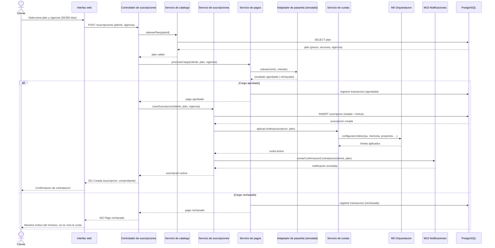
```mermaid
sequenceDiagram
    actor Cliente
    participant UI as Interfaz web
    participant SubCtrl as Controlador de suscripciones
    participant Catalogo as Servicio de catalogo
    participant Suscripcion as Servicio de suscripciones
    participant Pagos as Servicio de pagos
    participant Pasarela as Adaptador de pasarela (simulada)
    participant Cuotas as Servicio de cuotas
    participant Orquesta as M5 Orquestacion
    participant Notif as M10 Notificaciones
    participant BD as PostgreSQL

    Cliente->>UI: Selecciona plan y vigencia (30/365 dias)
    UI->>SubCtrl: POST /suscripciones (planId, vigencia)
    SubCtrl->>Catalogo: obtenerPlan(planId)
    Catalogo->>BD: SELECT plan
    BD-->>Catalogo: plan (precio, recursos, vigencia)
    Catalogo-->>SubCtrl: plan valido

    SubCtrl->>Pagos: procesarCargo(cliente, plan, vigencia)
    Pagos->>Pasarela: cobrar(monto, metodo)
    Pasarela-->>Pagos: resultado (aprobado | rechazado)

    alt Cargo aprobado
        Pagos->>BD: registrar transaccion (aprobada)
        Pagos-->>SubCtrl: pago aprobado

        SubCtrl->>Suscripcion: crearSuscripcion(cliente, plan, vigencia)
        Suscripcion->>BD: INSERT suscripcion (estado = Activa)
        BD-->>Suscripcion: suscripcion creada

        Suscripcion->>Cuotas: aplicarLimites(suscripcion, plan)
        Cuotas->>Orquesta: configurarLimites(cpu, memoria, proyectos, ...)
        Orquesta-->>Cuotas: limites aplicados
        Cuotas-->>Suscripcion: cuota activa

        Suscripcion->>Notif: enviarConfirmacionContratacion(cliente, plan)
        Notif-->>Suscripcion: notificacion encolada

        Suscripcion-->>SubCtrl: suscripcion activa
        SubCtrl-->>UI: 201 Creada (suscripcion, comprobante)
        UI-->>Cliente: Confirmacion de contratacion
    else Cargo rechazado
        Pagos->>BD: registrar transaccion (rechazada)
        Pagos-->>SubCtrl: pago rechazado
        SubCtrl-->>UI: 402 Pago rechazado
        UI-->>Cliente: Muestra motivo del rechazo, no se crea la cuota
    end
```

#### Secuencia: renovación

<!-- diagrama: docs/diagramas/m1-m10/m2-secuencia-renovacion.mmd -->
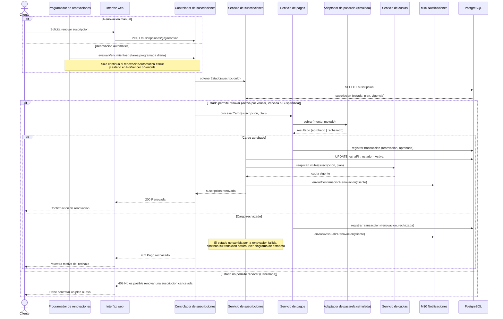
```mermaid
sequenceDiagram
    actor Cliente
    participant Sched as Programador de renovaciones
    participant UI as Interfaz web
    participant SubCtrl as Controlador de suscripciones
    participant Suscripcion as Servicio de suscripciones
    participant Pagos as Servicio de pagos
    participant Pasarela as Adaptador de pasarela (simulada)
    participant Cuotas as Servicio de cuotas
    participant Notif as M10 Notificaciones
    participant BD as PostgreSQL

    alt Renovacion manual
        Cliente->>UI: Solicita renovar suscripcion
        UI->>SubCtrl: POST /suscripciones/{id}/renovar
    else Renovacion automatica
        Sched->>SubCtrl: evaluarVencimientos() (tarea programada diaria)
        Note over Sched,SubCtrl: Solo continua si renovacionAutomatica = true<br/>y estado en PorVencer o Vencida
    end

    SubCtrl->>Suscripcion: obtenerEstado(suscripcionId)
    Suscripcion->>BD: SELECT suscripcion
    BD-->>Suscripcion: suscripcion (estado, plan, vigencia)

    alt Estado permite renovar (Activa por vencer, Vencida o Suspendida)
        SubCtrl->>Pagos: procesarCargo(suscripcion, plan)
        Pagos->>Pasarela: cobrar(monto, metodo)
        Pasarela-->>Pagos: resultado (aprobado | rechazado)

        alt Cargo aprobado
            Pagos->>BD: registrar transaccion (renovacion, aprobada)
            Suscripcion->>BD: UPDATE fechaFin, estado = Activa
            Suscripcion->>Cuotas: reaplicarLimites(suscripcion, plan)
            Cuotas-->>Suscripcion: cuota vigente
            Suscripcion->>Notif: enviarConfirmacionRenovacion(cliente)
            Suscripcion-->>SubCtrl: suscripcion renovada
            SubCtrl-->>UI: 200 Renovada
            UI-->>Cliente: Confirmacion de renovacion
        else Cargo rechazado
            Pagos->>BD: registrar transaccion (renovacion, rechazada)
            Suscripcion->>Notif: enviarAvisoFalloRenovacion(cliente)
            Note over Suscripcion: El estado no cambia por la renovacion fallida,<br/>continua su transicion natural (ver diagrama de estados)
            SubCtrl-->>UI: 402 Pago rechazado
            UI-->>Cliente: Muestra motivo del rechazo
        end
    else Estado no permite renovar (Cancelada)
        SubCtrl-->>UI: 409 No es posible renovar una suscripcion cancelada
        UI-->>Cliente: Debe contratar un plan nuevo
    end
```

#### Actividad: contratación y activación

<!-- diagrama: docs/diagramas/m1-m10/m2-actividad-contratacion-activacion.mmd -->
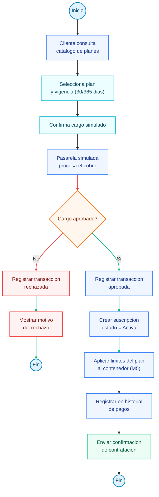
```mermaid
flowchart TB
    START(("Inicio")) --> A["Cliente consulta<br>catalogo de planes"]
    A --> B["Selecciona plan<br>y vigencia (30/365 dias)"]
    B --> C["Confirma cargo simulado"]
    C --> D["Pasarela simulada<br>procesa el cobro"]
    D --> E{"Cargo aprobado?"}
    E -- No --> F["Registrar transaccion<br>rechazada"]
    F --> G["Mostrar motivo<br>del rechazo"]
    G --> END1(("Fin"))
    E -- Si --> H["Registrar transaccion<br>aprobada"]
    H --> I["Crear suscripcion<br>estado = Activa"]
    I --> J["Aplicar limites del plan<br>al contenedor (M5)"]
    J --> K["Registrar en historial<br>de pagos"]
    K --> L["Enviar confirmacion<br>de contratacion"]
    L --> END2(("Fin"))

     START:::startEnd
     A:::process
     B:::input
     C:::input
     D:::process
     E:::decision
     F:::error
     G:::error
     END1:::startEnd
     H:::process
     I:::process
     J:::process
     K:::process
     L:::success
     END2:::startEnd
    classDef startEnd fill:#e0f2fe,stroke:#0284c7,stroke-width:2px,color:#0c4a6e
    classDef input fill:#ecfeff,stroke:#06b6d4,stroke-width:2px,color:#164e63
    classDef process fill:#eff6ff,stroke:#3b82f6,stroke-width:2px,color:#1e3a8a
    classDef decision fill:#fff7ed,stroke:#f97316,stroke-width:2px,color:#7c2d12
    classDef error fill:#fef2f2,stroke:#ef4444,stroke-width:2px,color:#7f1d1d
    classDef success fill:#ecfdf5,stroke:#10b981,stroke-width:2px,color:#065f46
    linkStyle 4 stroke:#ef4444,stroke-width:2px,fill:none
    linkStyle 5 stroke:#ef4444,stroke-width:2px,fill:none
    linkStyle 6 stroke:#10b981,stroke-width:2px,fill:none
    linkStyle 7 stroke:#10b981,stroke-width:2px,fill:none
    linkStyle 8 stroke:#10b981,stroke-width:2px,fill:none
    linkStyle 9 stroke:#10b981,stroke-width:2px,fill:none
    linkStyle 10 stroke:#10b981,stroke-width:2px,fill:none
```

#### Actividad: renovación

<!-- diagrama: docs/diagramas/m1-m10/m2-actividad-renovacion.mmd -->
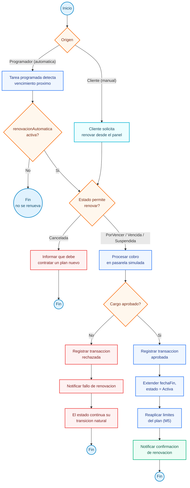
```mermaid
flowchart TB
    START(("Inicio")) --> A{"Origen"}
    A -- "Cliente (manual)" --> B["Cliente solicita<br>renovar desde el panel"]
    A -- "Programador (automatica)" --> C["Tarea programada detecta<br>vencimiento proximo"]
    C --> D{"renovacionAutomatica<br>activa?"}
    D -- No --> END0(("Fin<br>no se renueva"))
    D -- Si --> E
    B --> E{"Estado permite<br>renovar?"}
    E -- "Cancelada" --> F["Informar que debe<br>contratar un plan nuevo"]
    F --> END1(("Fin"))
    E -- "PorVencer / Vencida / Suspendida" --> G["Procesar cobro<br>en pasarela simulada"]
    G --> H{"Cargo aprobado?"}
    H -- No --> I["Registrar transaccion<br>rechazada"]
    I --> J["Notificar fallo de renovacion"]
    J --> K["El estado continua su<br>transicion natural"]
    K --> END2(("Fin"))
    H -- Si --> L["Registrar transaccion<br>aprobada"]
    L --> M["Extender fechaFin,<br>estado = Activa"]
    M --> N["Reaplicar limites<br>del plan (M5)"]
    N --> O["Notificar confirmacion<br>de renovacion"]
    O --> END3(("Fin"))

     START:::startEnd
     A:::decision
     B:::input
     C:::process
     D:::decision
     END0:::startEnd
     E:::decision
     F:::error
     END1:::startEnd
     G:::process
     H:::decision
     I:::error
     J:::error
     K:::error
     END2:::startEnd
     L:::process
     M:::process
     N:::process
     O:::success
     END3:::startEnd
    classDef startEnd fill:#e0f2fe,stroke:#0284c7,stroke-width:2px,color:#0c4a6e
    classDef input fill:#ecfeff,stroke:#06b6d4,stroke-width:2px,color:#164e63
    classDef process fill:#eff6ff,stroke:#3b82f6,stroke-width:2px,color:#1e3a8a
    classDef decision fill:#fff7ed,stroke:#f97316,stroke-width:2px,color:#7c2d12
    classDef error fill:#fef2f2,stroke:#ef4444,stroke-width:2px,color:#7f1d1d
    classDef success fill:#ecfdf5,stroke:#10b981,stroke-width:2px,color:#065f46
```

#### Actividad: gestión de planes (M9)

<!-- diagrama: docs/diagramas/m1-m10/m9-actividad-gestion-planes.mmd -->
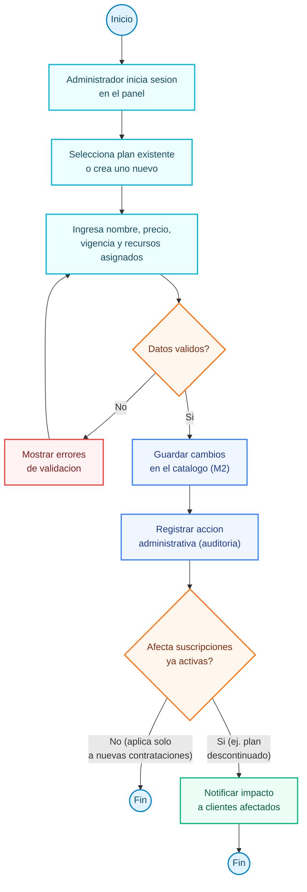
```mermaid
flowchart TB
    START(("Inicio")) --> A["Administrador inicia sesion<br>en el panel"]
    A --> B["Selecciona plan existente<br>o crea uno nuevo"]
    B --> C["Ingresa nombre, precio,<br>vigencia y recursos asignados"]
    C --> D{"Datos validos?"}
    D -- No --> E["Mostrar errores<br>de validacion"]
    E --> C
    D -- Si --> F["Guardar cambios<br>en el catalogo (M2)"]
    F --> G["Registrar accion<br>administrativa (auditoria)"]
    G --> H{"Afecta suscripciones<br>ya activas?"}
    H -- "No (aplica solo<br>a nuevas contrataciones)" --> END1(("Fin"))
    H -- "Si (ej. plan<br>descontinuado)" --> I["Notificar impacto<br>a clientes afectados"]
    I --> END2(("Fin"))

     START:::startEnd
     A:::input
     B:::input
     C:::input
     D:::decision
     E:::error
     F:::process
     G:::process
     H:::decision
     END1:::startEnd
     I:::success
     END2:::startEnd
    classDef startEnd fill:#e0f2fe,stroke:#0284c7,stroke-width:2px,color:#0c4a6e
    classDef input fill:#ecfeff,stroke:#06b6d4,stroke-width:2px,color:#164e63
    classDef process fill:#eff6ff,stroke:#3b82f6,stroke-width:2px,color:#1e3a8a
    classDef decision fill:#fff7ed,stroke:#f97316,stroke-width:2px,color:#7c2d12
    classDef error fill:#fef2f2,stroke:#ef4444,stroke-width:2px,color:#7f1d1d
    classDef success fill:#ecfdf5,stroke:#10b981,stroke-width:2px,color:#065f46
```

### 4.3 M3 Proyectos y fuentes + M7 Observabilidad

#### Componentes M3 + M7

<!-- diagrama: docs/diagramas/m1-m10/m3-m7-componentes.mmd -->
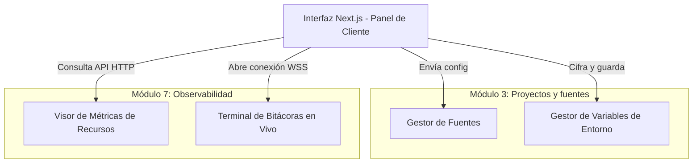
```mermaid
flowchart TD
    %% Interfaz
    UI[Interfaz Next.js - Panel de Cliente]

    %% Componentes M3
    subgraph M3 [Módulo 3: Proyectos y fuentes]
        G[Gestor de Fuentes]
        V[Gestor de Variables de Entorno]
    end

    %% Componentes M7
    subgraph M7 [Módulo 7: Observabilidad]
        M[Visor de Métricas de Recursos]
        B[Terminal de Bitácoras en Vivo]
    end

    %% Relaciones
    UI -->|Envía config| G
    UI -->|Cifra y guarda| V
    UI -->|Consulta API HTTP| M
    UI -->|Abre conexión WSS| B
```

#### Clases M3 + M7 (pulido: `ISourceProvider` → `ProveedorFuente`; `ProjectController` → `ControladorProyecto`)

El ERD y las clases **canónicos** son los unificados (§6 y §7).

<!-- diagrama: docs/diagramas/m1-m10/m3-m7-clases.mmd -->
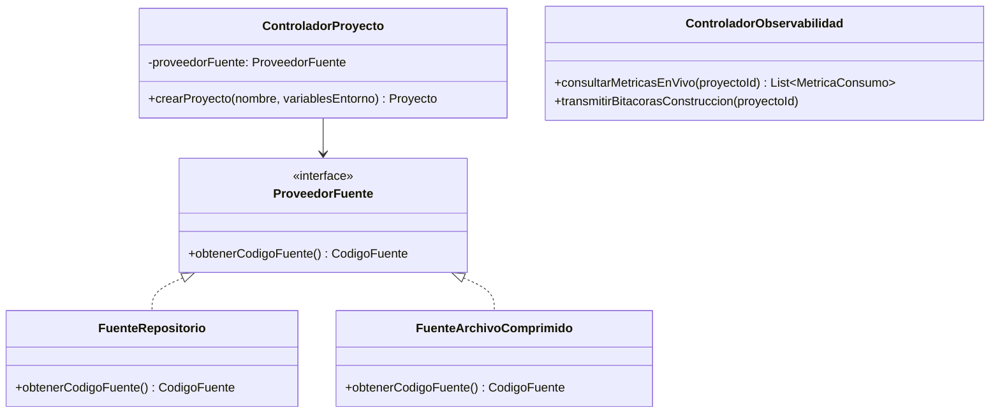
```mermaid
classDiagram
    class ProveedorFuente {
        <<interface>>
        +obtenerCodigoFuente() CodigoFuente
    }
    class FuenteRepositorio {
        +obtenerCodigoFuente() CodigoFuente
    }
    class FuenteArchivoComprimido {
        +obtenerCodigoFuente() CodigoFuente
    }
    ProveedorFuente <|.. FuenteRepositorio
    ProveedorFuente <|.. FuenteArchivoComprimido

    class ControladorProyecto {
        -proveedorFuente: ProveedorFuente
        +crearProyecto(nombre, variablesEntorno) Proyecto
    }
    ControladorProyecto --> ProveedorFuente

    class ControladorObservabilidad {
        +consultarMetricasEnVivo(proyectoId) List~MetricaConsumo~
        +transmitirBitacorasConstruccion(proyectoId)
    }
```

#### Actividad: crear proyecto (original de compañeros; es `stateDiagram-v2`)

<!-- diagrama: docs/diagramas/m1-m10/m3-actividad-crear-proyecto.mmd -->
```mermaid
stateDiagram-v2
    [*] --> IniciarFormulario
    IniciarFormulario --> IngresarNombreYFuente
    IngresarNombreYFuente --> AgregarVariablesEntorno
    AgregarVariablesEntorno --> ValidarDatos

    state ValidarDatos {
        [*] --> Verificacion
        Verificacion --> DatosInvalidos
        Verificacion --> DatosValidos
    }

    DatosInvalidos --> IngresarNombreYFuente : Corregir errores
    DatosValidos --> EnviarSolicitudDespliegue
    EnviarSolicitudDespliegue --> [*]
```

#### Actividad: consultar métricas (original de compañeros)

<!-- diagrama: docs/diagramas/m1-m10/m7-actividad-consultar-metricas.mmd -->
```mermaid
stateDiagram-v2
    [*] --> EntrarDashboardProyecto
    EntrarDashboardProyecto --> CargarDatos

    fork
        CargarDatos --> PeticionHTTPMetricas
        PeticionHTTPMetricas --> RenderizarGraficasCPUyRAM
    end

    fork
        CargarDatos --> IniciarConexionWebSocket
        IniciarConexionWebSocket --> RecibirLogsEnVivo
        RecibirLogsEnVivo --> RenderizarConsola
    end

    RenderizarGraficasCPUyRAM --> [*]
    RenderizarConsola --> [*]
```

---

## 5. Sistema de diseño

Design system v4.1: [diseno/](diseno/README.md) (principios, tokens, [guía de construcción](diseno/guia-construccion.md) y una ficha por pantalla). Claro por defecto, neutros cálidos, acento Señal, Geist / Geist Mono, Lucide; componentes en `apps/web/src/components` y catálogo en `/sistema`. Mapa de archivos: [apps/web/README.md](../apps/web/README.md).

## 6. ERD unificado

Única fuente, recortada al núcleo v4.1 y **firmada** como contrato de datos ([contratos/datos-nucleo.md](contratos/datos-nucleo.md)): identidad, suscripción y pagos, administración, proyectos con variables cifradas, y del motor `Despliegue`, `EtapaDespliegue`, `LineaBitacora` y `Artefacto` (versionado y reversión). Las entidades de la propuesta completa (espacios, complementos, dominios, métricas, notificaciones) quedan en el historial de git.

<!-- diagrama: docs/diagramas/compartido/erd-unificado.mmd -->
```mermaid
---
title: ERD del núcleo v4.1 — fuente del schema Prisma (docs/contratos/datos-nucleo.md)
---
erDiagram
    USUARIO ||--o{ TOKEN_CUENTA : recibe
    USUARIO ||--o{ SESION : abre
    USUARIO ||--|| SUSCRIPCION : tiene
    USUARIO ||--o{ PAGO : realiza
    USUARIO ||--o{ PROYECTO : posee
    USUARIO ||--o{ ACCION_ADMINISTRATIVA : "ejecuta (admin)"
    USUARIO ||--o{ ACCION_ADMINISTRATIVA : "recibe"
    PLAN ||--o{ SUSCRIPCION : "plan actual"
    PLAN |o--o{ SUSCRIPCION : "descenso programado"
    PLAN ||--o{ PAGO : cobra
    SUSCRIPCION ||--o{ PAGO : genera
    PROYECTO ||--o{ VARIABLE_ENTORNO : configura
    PROYECTO ||--o{ DESPLIEGUE : tiene
    PROYECTO ||--o{ ARTEFACTO : versiona
    PROYECTO |o--o| DESPLIEGUE : "activo"
    ARTEFACTO |o--o{ DESPLIEGUE : "construido o reusado por"
    DESPLIEGUE ||--|{ ETAPA_DESPLIEGUE : "cinco etapas"
    DESPLIEGUE ||--o{ LINEA_BITACORA : produce

    USUARIO {
        string id PK
        string correo UK
        string nombre
        string hashContrasena
        Rol rol "cliente | administrador"
        EstadoCuenta estadoCuenta "pendiente | activa | suspendida"
        string motivoSuspension
        datetime creado
    }
    TOKEN_CUENTA {
        string id PK
        string usuarioId FK
        TipoTokenCuenta tipo "verificacion 24 h | recuperacion 30 min"
        string hashToken UK
        datetime expira
        datetime usadoEn "un solo uso"
    }
    SESION {
        string id PK
        string usuarioId FK
        string hashToken UK
        datetime ultimaActividad "expira a los 7 días sin actividad"
        datetime revocadaEn
    }
    PLAN {
        string id PK
        string codigo UK "sandbox | starter | pro | business"
        decimal precio30
        decimal precio365
        int maxProyectos
        decimal cpus
        int memoriaMb
        int construccionesMes
    }
    SUSCRIPCION {
        string id PK
        string usuarioId FK,UK "una por cuenta"
        string planId FK
        EstadoSuscripcion estado "activa | por-vencer | vencida | suspendida | cancelada"
        datetime estadoDesde
        int vigenciaDias "30 | 365 | null"
        datetime vence "null en Sandbox"
        string planSiguienteId FK
    }
    PAGO {
        string id PK
        string usuarioId FK
        string suscripcionId FK
        string planId FK
        ConceptoPago concepto
        decimal monto
        EstadoPago estado "aprobado | rechazado"
        string tarjetaUltimos4
        string numeroComprobante UK
    }
    ACCION_ADMINISTRATIVA {
        string id PK
        string adminId FK
        string usuarioAfectadoId FK
        string accion "suspender-cuenta"
        string motivo
        string detalle
    }
    PROYECTO {
        string id PK
        string usuarioId FK
        string nombre
        string subdominio UK "inmutable"
        string urlRepositorio
        string rama
        string rutaDockerfile
        int puertoInterno
        RecetaConstruccion receta "dockerfile | node | python | go | estatica"
        string despliegueActivoId FK,UK
    }
    VARIABLE_ENTORNO {
        string id PK
        string proyectoId FK
        string clave "UK con proyectoId"
        string valorCifrado "AES-256-GCM"
    }
    ARTEFACTO {
        string id PK
        string proyectoId FK
        int numero "UK con proyectoId"
        string imagen "deploya/subdominio:n"
        string digest
        bigint tamanoBytes
        string commitSha
        RecetaConstruccion receta
        boolean disponible "retención: últimos 5"
    }
    DESPLIEGUE {
        string id PK
        string proyectoId FK
        int numero "UK con proyectoId"
        EstadoDespliegue estado
        DisparadorDespliegue disparador
        string commitSha
        string artefactoId FK
        string contenedorId
        string url
        decimal cpus
        int memoriaMb
        int codigoSalida
        string motivoFallo
        datetime creado
        datetime terminado
    }
    ETAPA_DESPLIEGUE {
        string despliegueId PK,FK
        Etapa etapa PK "recepcion..operacion"
        EstadoEtapa estado "pendiente | en-curso | completada | fallida | omitida"
        datetime iniciada
        datetime terminada
    }
    LINEA_BITACORA {
        string despliegueId PK,FK
        int n PK "consecutivo; desde= filtra n mayor"
        datetime marca
        Etapa etapa
        NivelBitacora nivel "info | aviso | error"
        string texto
    }
```

---

## 7. Diagrama de clases unificado

Única fuente. Puertos como `abstract class` sin `I`, con **una sola firma** (cierra C2 de la auditoría): la misma en código, en este diagrama y en el canvas. Patrones: Facade (`ConstruccionService`, `SuscripcionesService`), State (`TransicionesDespliegue`), Strategy (`RecetaStack`, `PasarelaPago`), Chain of Responsibility (`PasoPipeline`), Command (`TrabajoDespliegue`), Observer (`DespliegueTerminado` → `RetencionArtefactos`), Adapter y Repository.

<!-- diagrama: docs/diagramas/compartido/clases-unificado.mmd -->
```mermaid
---
title: Diagrama de clases unificado — núcleo v4.1 (firma única de puertos; abstract class sin I)
---
classDiagram
    direction TB

    %% ───────── Transversal ─────────
    class Reloj {
        <<abstract>>
        +ahora() Date
    }

    %% ───────── M1 Identidad · M10 Notificaciones (Eddy) ─────────
    class IdentidadService {
        -hash HashContrasena
        -correo CorreoPuerto
        -reloj Reloj
        +registrar(correo, nombre, clave) Usuario
        +verificar(token) void
        +iniciarSesion(correo, clave) Sesion
        +cerrarSesion(sesionId) void
    }
    class PoliticaContrasena {
        +validar(clave) ResultadoPolitica
    }
    class HashContrasena {
        <<abstract>>
        +calcular(clave) String
        +coincide(clave, hash) Boolean
    }
    class SesionGuard {
        +canActivate(contexto) Boolean
    }
    class CorreoPuerto {
        <<abstract>>
        +enviar(destinatario, plantilla, datos) void
    }
    class CorreoSmtpAdaptador
    class CorreoConsolaAdaptador

    %% ───────── M2 Suscripciones · M9 Administración (Javier) ─────────
    class SuscripcionesService {
        <<Facade>>
        -pasarela PasarelaPago
        -reloj Reloj
        +asignarSandbox(usuarioId) void
        +cuotaDe(usuarioId) Cuota
        +contratar(usuarioId, planCodigo, vigenciaDias, tarjeta) Pago
        +renovar(usuarioId, tarjeta) Pago
        +cambiarPlan(usuarioId, planCodigo, tarjeta) Pago
    }
    class Cuota {
        <<valor>>
        +plan PlanResumen
        +estado EstadoSuscripcion
        +vence Date
        +maxProyectos Integer
        +cpus Decimal
        +memoriaMb Integer
        +construccionesMes Integer
    }
    class PoliticaCicloSuscripcion {
        +avanzar(suscripcion, ahora) EstadoSuscripcion
    }
    class PasarelaPago {
        <<abstract>>
        +cobrar(monto, tarjeta) ResultadoPago
    }
    class PasarelaSimulada
    class AdministracionService {
        +suspender(adminId, usuarioId, motivo, detalle) void
    }

    %% ───────── M3 Proyectos · M7 Observabilidad (Eduardo) ─────────
    class ProyectosService {
        -fuente ProveedorFuente
        +validarRepositorio(url, rama) RepositorioValidado
        +crear(usuarioId, alta) Proyecto
    }
    class ProveedorFuente {
        <<abstract>>
        +inspeccionar(url, rama) RepositorioInspeccionado
        +lector(url, rama) LectorFuente
    }
    class FuenteGitHubPublica
    class ParserExpose {
        +puertos(dockerfile) List~Integer~
    }

    %% ───────── M4 Construcción (Derek) ─────────
    class ConstruccionService {
        <<Facade>>
        -cola ColaConstruccionPuerto
        -despliegues RepositorioDespliegues
        -proyectos ProyectosLecturaPuerto
        -reloj Reloj
        +crearDespliegue(proyectoId, disparador) DespliegueCreado
        +consultar(despliegueId, usuarioId) VistaDespliegue
        +bitacoraDesde(despliegueId, usuarioId, desde) PaginaBitacora
    }
    class DeteccionStackService {
        -recetas List~RecetaStack~
        +detectar(fuente LectorFuente) ResultadoDeteccion
    }
    class RecetaStack {
        <<abstract>>
        +receta RecetaConstruccion
        +archivosQueLee List~String~
        +reconoce(archivos MapaArchivos) Boolean
        +dockerfile(archivos MapaArchivos) String
        +puertoSugerido(archivos MapaArchivos) Integer
    }
    class RecetaDockerfile
    class RecetaNode
    class RecetaPython
    class RecetaGo
    class RecetaEstatica
    class PipelineDespliegue {
        -despliegues RepositorioDespliegues
        -eventos PublicadorEventos
        -reloj Reloj
        +ejecutar(trabajo TrabajoDespliegue) void
    }
    class PasoPipeline {
        <<abstract>>
        +etapa Etapa
        +ejecutar(contexto ContextoDespliegue) void
    }
    class PasoRecepcion {
        -clonador ClonadorRepositorioPuerto
        -deteccion DeteccionStackService
    }
    class PasoConstruccion {
        -constructor ConstructorImagenPuerto
        -artefactos RepositorioArtefactos
    }
    class TrabajoDespliegue {
        <<Command>>
        +despliegueId String
        +plan PlanPipeline
    }
    class TransicionesDespliegue {
        <<State>>
        +transicionar(de, a) EstadoDespliegue
        +etapaDe(estado) Etapa
    }
    class PoliticaDespliegue {
        +puedeConstruir(cuota, construccionesDelMes) Decision
    }

    %% ───────── M5 Orquestación (Derek) ─────────
    class OrquestacionService {
        -contenedores ContenedorPuerto
        -salud VerificacionEntornoPuerto
        -cuota CuotaPlanPuerto
        +aprovisionar(contexto) ContenedorCreado
        +detener(proyectoId) void
        +reiniciar(proyectoId) void
        +detenerTodosDe(usuarioId) void
    }
    class ReversionService {
        -artefactos RepositorioArtefactos
        -despliegues RepositorioDespliegues
        -cola ColaConstruccionPuerto
        +revertir(proyectoId, artefactoId, usuarioId) DespliegueCreado
    }
    class PasoEjecucion {
        -orquestacion OrquestacionService
    }
    class PasoOperacion {
        -contenedores ContenedorPuerto
    }
    class RetencionArtefactos {
        <<Observer>>
        +alTerminar(evento DespliegueTerminado) void
    }
    class PoliticaRetencion {
        +aRetirar(artefactos, activoId) List~Artefacto~
    }
    class LimitesContenedor {
        <<valor>>
        +nanoCpus Integer
        +memoriaBytes Integer
        +desde(cuota) LimitesContenedor
    }

    %% ───────── M6 Enrutamiento (Derek) ─────────
    class EnrutamientoService {
        -enrutamiento EnrutamientoPuerto
        +publicar(subdominio, contenedor) String
        +retirar(subdominio) void
    }
    class PasoEnrutamiento {
        -enrutamiento EnrutamientoService
    }

    %% ───────── Puertos del motor ─────────
    class ColaConstruccionPuerto {
        <<abstract>>
        +encolar(trabajo TrabajoDespliegue) void
        +retirar(despliegueId) Boolean
    }
    class ClonadorRepositorioPuerto {
        <<abstract>>
        +clonar(solicitud SolicitudClon) ClonListo
        +existeArchivo(directorio, ruta) Boolean
        +limpiar(directorio) void
    }
    class ProyectosLecturaPuerto {
        <<abstract>>
        +porId(proyectoId) ProyectoDesplegable
    }
    class CuotaPlanPuerto {
        <<abstract>>
        +recursosDe(usuarioId) RecursosPlan
    }
    class ConstructorImagenPuerto {
        <<abstract>>
        +construir(solicitud SolicitudConstruccion, alLinea) ImagenConstruida
    }
    class LectorFuente {
        <<abstract>>
        +existe(ruta) Boolean
        +leer(ruta) String
    }
    class RepositorioDespliegues {
        <<abstract>>
        +crear(nuevo NuevoDespliegue) Despliegue
        +porId(id) Despliegue
        +cambiarEstado(id, estado, cambios) void
        +marcarEtapa(id, etapa, estadoEtapa, marca) void
        +agregarLineas(id, lineas) void
        +lineasDesde(id, desde, limite) List~LineaBitacora~
        +activoDe(proyectoId) Despliegue
        +marcarActivo(proyectoId, despliegueId) void
        +construccionesDesde(usuarioId, desde) Integer
    }
    class RepositorioArtefactos {
        <<abstract>>
        +registrar(artefacto) Artefacto
        +porId(id) Artefacto
        +disponiblesDe(proyectoId) List~Artefacto~
        +marcarNoDisponible(id) void
    }
    class ContenedorPuerto {
        <<abstract>>
        +crear(espec EspecContenedor) ContenedorCreado
        +detener(contenedorId) void
        +reiniciar(contenedorId) void
        +eliminar(contenedorId) void
        +eliminarImagen(imagen) void
    }
    class VerificacionEntornoPuerto {
        <<abstract>>
        +saludable(objetivo ObjetivoSalud) ResultadoSalud
    }
    class EnrutamientoPuerto {
        <<abstract>>
        +publicar(ruta RutaPublica) UrlPublicada
        +retirar(subdominio) void
    }

    %% ───────── Adaptadores (y stubs con la misma firma) ─────────
    class ColaBullMq
    class ClonadorGit
    class ConstructorDocker
    class LectorFuenteLocal
    class RepositorioDesplieguesPrisma
    class ContenedorDocker
    class VerificacionHttp
    class EnrutamientoTraefikArchivo

    %% ───────── Entidades y enumeraciones ─────────
    class Despliegue {
        +id String
        +numero Integer
        +estado EstadoDespliegue
        +disparador DisparadorDespliegue
        +commitSha String
        +codigoSalida Integer
    }
    class Artefacto {
        +numero Integer
        +imagen String
        +digest String
        +tamanoBytes Integer
        +receta RecetaConstruccion
        +disponible Boolean
    }
    class EstadoDespliegue {
        <<enumeration>>
        encolado
        construyendo
        aprovisionando
        publicando
        saludable
        fallido
        cancelado
        detenido
        revirtiendo
    }
    class EstadoSuscripcion {
        <<enumeration>>
        activa
        por-vencer
        vencida
        suspendida
        cancelada
    }
    class Etapa {
        <<enumeration>>
        recepcion
        construccion
        ejecucion
        enrutamiento
        operacion
    }
    class PlanPipeline {
        <<enumeration>>
        construccion
        reversion
    }

    %% ───────── Relaciones ─────────
    IdentidadService --> PoliticaContrasena
    IdentidadService --> HashContrasena
    IdentidadService --> CorreoPuerto
    IdentidadService --> SuscripcionesService : asignarSandbox
    CorreoPuerto <|-- CorreoSmtpAdaptador
    CorreoPuerto <|-- CorreoConsolaAdaptador
    SuscripcionesService --> PoliticaCicloSuscripcion
    SuscripcionesService --> PasarelaPago
    SuscripcionesService ..> Cuota
    PasarelaPago <|-- PasarelaSimulada
    AdministracionService --> OrquestacionService : detenerTodosDe
    ProyectosService --> ProveedorFuente
    ProyectosService --> ParserExpose
    ProyectosService --> DeteccionStackService : detectar
    ProyectosService --> ConstruccionService : crearDespliegue
    ProveedorFuente <|-- FuenteGitHubPublica

    ConstruccionService --> ColaConstruccionPuerto
    ConstruccionService --> RepositorioDespliegues
    ConstruccionService --> PoliticaDespliegue
    ConstruccionService --> TransicionesDespliegue
    ConstruccionService --> ProyectosLecturaPuerto
    ProyectosLecturaPuerto ..> ProyectosService : adaptador sobre M3
    DeteccionStackService --> RecetaStack
    DeteccionStackService --> LectorFuente
    RecetaStack <|-- RecetaDockerfile
    RecetaStack <|-- RecetaNode
    RecetaStack <|-- RecetaPython
    RecetaStack <|-- RecetaGo
    RecetaStack <|-- RecetaEstatica
    PipelineDespliegue --> PasoPipeline
    PipelineDespliegue --> TransicionesDespliegue
    PipelineDespliegue ..> TrabajoDespliegue
    PasoPipeline <|-- PasoRecepcion
    PasoPipeline <|-- PasoConstruccion
    PasoPipeline <|-- PasoEjecucion
    PasoPipeline <|-- PasoEnrutamiento
    PasoPipeline <|-- PasoOperacion
    PasoRecepcion --> ClonadorRepositorioPuerto
    PasoRecepcion --> DeteccionStackService
    PasoConstruccion --> ConstructorImagenPuerto
    PasoConstruccion --> RepositorioArtefactos
    PasoEjecucion --> OrquestacionService
    PasoEnrutamiento --> EnrutamientoService
    PasoOperacion --> ContenedorPuerto
    OrquestacionService --> ContenedorPuerto
    OrquestacionService --> VerificacionEntornoPuerto
    OrquestacionService --> LimitesContenedor
    OrquestacionService --> CuotaPlanPuerto
    CuotaPlanPuerto ..> SuscripcionesService : adaptador sobre cuotaDe
    ReversionService --> RepositorioArtefactos
    ReversionService --> ColaConstruccionPuerto
    RetencionArtefactos --> PoliticaRetencion
    RetencionArtefactos --> ContenedorPuerto
    RetencionArtefactos --> RepositorioArtefactos
    EnrutamientoService --> EnrutamientoPuerto

    ColaConstruccionPuerto <|-- ColaBullMq
    ClonadorRepositorioPuerto <|-- ClonadorGit
    ConstructorImagenPuerto <|-- ConstructorDocker
    LectorFuente <|-- LectorFuenteLocal
    RepositorioDespliegues <|-- RepositorioDesplieguesPrisma
    ContenedorPuerto <|-- ContenedorDocker
    VerificacionEntornoPuerto <|-- VerificacionHttp
    EnrutamientoPuerto <|-- EnrutamientoTraefikArchivo

    Despliegue --> EstadoDespliegue
    Despliegue "*" --> "0..1" Artefacto
    TrabajoDespliegue --> PlanPipeline
    PasoPipeline --> Etapa
    Cuota --> EstadoSuscripcion
```

---

## 8. Estados

### 8.1 Suscripción (§4.4) — entrega M2

No copiar estos cinco estados al despliegue.

<!-- diagrama: docs/diagramas/m1-m10/m2-estados-suscripcion.mmd -->
```mermaid
stateDiagram-v2
    [*] --> Activa : contratacion con pago aprobado

    Activa --> PorVencer : faltan 7 dias o menos<br/>para el vencimiento
    PorVencer --> Activa : renovacion exitosa<br/>(manual o automatica)
    PorVencer --> Vencida : se cumple la fecha<br/>de vencimiento sin renovar

    Vencida --> Activa : renovacion exitosa dentro<br/>del periodo de gracia (5 dias)
    Vencida --> Suspendida : termina el periodo de<br/>gracia sin renovacion

    Suspendida --> Activa : renovacion exitosa durante<br/>la suspension (*)
    Suspendida --> Cancelada : 30 dias en Suspendida<br/>sin renovar, o cancelacion<br/>solicitada por el cliente

    Activa --> Cancelada : cancelacion solicitada<br/>por el cliente
    PorVencer --> Cancelada : cancelacion solicitada<br/>por el cliente

    Cancelada --> [*] : recursos liberados<br/>(tras ventana de exportacion)

    note right of Activa
        Todos los entornos operan
        con la cuota contratada
    end note
    note right of Vencida
        Entornos en linea;
        nuevos despliegues bloqueados
    end note
    note right of Suspendida
        Contenedores detenidos;
        datos y configuracion conservados
    end note
    note right of Cancelada
        Recursos liberados;
        cliente puede exportar datos antes
    end note
```

### 8.2 Despliegue / contenedor — dominio §3.2

Encolado → Construyendo → Aprovisionando → Publicando → Saludable. Revirtiendo entra directo a Aprovisionando sin construir. Fallido, Cancelado y Detenido son error, cancelación por el cliente y parada (p. ej. suscripción Suspendida). **No** son Activa / Por vencer / Vencida / Suspendida / Cancelada.

<!-- diagrama: docs/diagramas/m1-m10/m4-m5-m6-estados-despliegue.mmd -->
```mermaid
---
title: Estados del despliegue — núcleo v4.1 con reversión (no son los de suscripción)
---
stateDiagram-v2
    [*] --> Encolado : crearDespliegue (alta, manual, reintento, redespliegue, variables)
    [*] --> Revirtiendo : revertir a un artefacto disponible (no consume construcciones)

    Encolado --> Construyendo : el trabajador toma el trabajo
    Encolado --> Cancelado : el cliente cancela
    Construyendo --> Aprovisionando : artefacto #n registrado (digest y tamaño)
    Construyendo --> Fallido : clon falla, stack no reconocido, docker build falla o pasa de 10 min
    Construyendo --> Cancelado : el cliente cancela

    Revirtiendo --> Aprovisionando : la imagen del artefacto sigue en el nodo
    Revirtiendo --> Fallido : la imagen ya fue retirada

    Aprovisionando --> Publicando : contenedor con límites del plan responde a la salud (máx. 60 s)
    Aprovisionando --> Fallido : el contenedor no arranca o no responde

    Publicando --> Saludable : Traefik apunta al contenedor nuevo y se detiene el anterior
    Publicando --> Fallido : falla el enrutamiento

    Saludable --> Detenido : el cliente detiene, suscripción Suspendida o cuenta suspendida
    Detenido --> Aprovisionando : el cliente reinicia

    Fallido --> [*]
    Cancelado --> [*]

    note right of Encolado
        Etapa Recepción pendiente.
        Reintentar y redesplegar crean
        un despliegue nuevo (#n+1).
    end note
    note right of Construyendo
        Etapas Recepción y Construcción:
        git clone, detección de stack,
        docker build con Dockerfile o receta.
    end note
    note left of Revirtiendo
        Recepción y Construcción
        quedan «omitida».
        Reusa la imagen deploya/p:n.
    end note
    note right of Aprovisionando
        Etapa Ejecución: red del proyecto,
        --cpus y --memory de cuotaDe,
        sin privilegios.
    end note
    note right of Publicando
        Etapa Enrutamiento: ruta dinámica
        de Traefik; conmutación sin corte.
    end note
    note right of Saludable
        Etapa Operación. Proyecto.despliegueActivo
        cambia aquí; el anterior se detiene
        y la retención deja 5 artefactos.
    end note
    note left of Fallido
        La versión activa sigue
        sirviendo tráfico.
        Guarda codigoSalida y motivo.
    end note
```

---

## 9. Secuencias de despliegue

### 9.1 Despliegue por construcción hasta Saludable / Fallido

<!-- diagrama: docs/diagramas/m1-m10/m4-m5-m6-secuencia-despliegue.mmd -->
```mermaid
---
title: Secuencia de un despliegue por construcción — Recepción → Construcción → Ejecución → Enrutamiento → Operación
---
sequenceDiagram
    autonumber
    actor Cliente
    participant Web as web (pantallas 11d, 12)
    participant API as ConstruccionService (api)
    participant M2 as SuscripcionesService
    participant BD as PostgreSQL
    participant Cola as ColaBullMq (Redis)
    participant W as PipelineDespliegue (worker)
    participant Git as ClonadorGit
    participant Det as DeteccionStackService
    participant Img as ConstructorDocker
    participant Orq as OrquestacionService
    participant Cont as ContenedorDocker
    participant Salud as VerificacionHttp
    participant Ruta as EnrutamientoTraefikArchivo

    Cliente->>Web: Desplegar
    Web->>API: POST /proyectos/:id/despliegues
    API->>M2: cuotaDe(usuarioId)
    API->>BD: Despliegue #n encolado + 5 etapas pendientes
    API->>Cola: encolar(TrabajoDespliegue{despliegueId, plan: construccion})
    API-->>Web: 201 {id, numero, estado: encolado}

    loop cada 3 s mientras terminado = false
        Web->>API: GET /despliegues/:id y /bitacora?desde=n
        API->>BD: estado, etapas, líneas n > desde
        API-->>Web: riel de etapas + líneas nuevas
    end

    Cola->>W: trabajo
    W->>BD: construyendo · recepción en curso
    Note over W,Det: 1 · Recepción
    W->>Git: clonar(url, rama, destino) --depth 1
    Git-->>W: commit {sha, mensaje, autor}
    W->>Det: detectar(LectorFuenteLocal)
    Det-->>W: receta dockerfile o node/python/go/estatica
    W->>BD: commit, receta, líneas de bitácora

    Note over W,Img: 2 · Construcción
    W->>Img: construir(directorio, etiqueta deploya/p:n, 10 min, alLinea)
    loop cada línea de docker build
        Img-->>W: alLinea(texto)
        W->>BD: LineaBitacora n, marca, etapa construccion
    end

    alt build correcto
        Img-->>W: {digest, tamanoBytes}
        W->>BD: Artefacto #n · aprovisionando
        Note over W,Salud: 3 · Ejecución
        W->>Orq: aprovisionar(contexto)
        Orq->>M2: cuotaDe(usuarioId)
        Orq->>Cont: crear({nombre, imagen, red del proyecto, cpus, memoriaMb, variables})
        Cont-->>Orq: {id, host}
        Orq->>Salud: saludable({host, puerto, ruta /, 60 s})
        alt responde
            Salud-->>Orq: ok, 200 en 38 ms
            Note over W,Ruta: 4 · Enrutamiento
            W->>BD: publicando
            W->>Ruta: publicar({subdominio, host, puerto})
            Ruta-->>W: url http(s)://p.dominio
            Note over W,Cont: 5 · Operación
            W->>BD: saludable · Proyecto.despliegueActivo = #n
            W->>Cont: detener(contenedor anterior)
            W->>W: publica DespliegueTerminado (retención de artefactos)
        else no responde en 60 s
            Salud-->>Orq: falla
            Orq->>Cont: eliminar(contenedor nuevo)
            W->>BD: fallido · la versión activa no cambia
        end
    else build falla o pasa de 10 min
        Img-->>W: ConstruccionFallida(codigoSalida)
        W->>BD: fallido · codigoSalida · motivo · construcción fallida
    end
```

### 9.2 Reversión sin reconstruir (M5-04)

<!-- diagrama: docs/diagramas/m1-m10/m4-m5-m6-secuencia-reversion.mmd -->
```mermaid
---
title: Secuencia de reversión — vuelve a un artefacto anterior sin reconstruir (M5-04)
---
sequenceDiagram
    autonumber
    actor Cliente
    participant Web as web (pantalla 14)
    participant Rev as ReversionService (api)
    participant BD as PostgreSQL
    participant Cola as ColaBullMq (Redis)
    participant W as PipelineDespliegue (worker)
    participant Orq as OrquestacionService
    participant Cont as ContenedorDocker
    participant Salud as VerificacionHttp
    participant Ruta as EnrutamientoTraefikArchivo

    Cliente->>Web: Revertir a la versión #13
    Web->>Rev: POST /proyectos/:id/reversiones {artefactoId}
    Rev->>BD: artefacto #13 del proyecto
    alt no disponible, ya activo o hay un despliegue en curso
        Rev-->>Web: 409 artefacto-no-disponible · artefacto-ya-activo · despliegue-en-curso
    else disponible
        Rev->>BD: Despliegue #16 revirtiendo · disparador reversion · artefacto #13 · recepción y construcción omitidas
        Rev->>Cola: encolar(TrabajoDespliegue{despliegueId, plan: reversion})
        Rev-->>Web: 201 {id, numero: 16, estado: revirtiendo}
        Note over Rev,W: No se clona ni se construye. No consume construcciones del mes.
        Cola->>W: trabajo
        W->>BD: aprovisionando · ejecución en curso
        W->>Orq: aprovisionar(contexto con la imagen deploya/p:13)
        Orq->>Cont: crear(imagen deploya/p:13, límites vigentes, variables vigentes)
        Orq->>Salud: saludable(host, puerto, 60 s)
        alt responde
            W->>Ruta: publicar(subdominio → contenedor #16)
            W->>BD: saludable · Proyecto.despliegueActivo = #16
            W->>Cont: detener(contenedor de #15)
        else no responde
            W->>Cont: eliminar(contenedor #16)
            W->>BD: fallido · #15 sigue activo
        end
    end
```

### 9.3 Recorrido de punta a punta del Avance 1

<!-- diagrama: docs/diagramas/compartido/secuencia-recorrido-e2e.mmd -->
```mermaid
---
title: Recorrido de punta a punta del Avance 1 — de registrarse a ver la app Saludable
---
sequenceDiagram
    autonumber
    actor Cliente
    participant Web as web
    participant M1 as M1 Identidad
    participant M10 as M10 CorreoPuerto
    participant Mail as Mailpit
    participant M2 as M2 Suscripciones
    participant M3 as M3 Proyectos
    participant GH as GitHub
    participant M4 as M4 Construcción (api)
    participant W as worker M4 M5 M6
    participant Edge as Traefik

    Note over Cliente,Edge: Eddy · pantallas 01, 02, 03
    Cliente->>Web: Registro (01)
    Web->>M1: POST /identidad/registro
    M1->>M2: asignarSandbox(usuarioId)
    M1->>M10: enviar(verificacion, enlace 24 h)
    M10->>Mail: SMTP
    Cliente->>Mail: abre el correo (localhost:8025)
    Cliente->>Web: enlace de verificación (02)
    Web->>M1: POST /identidad/verificar
    Cliente->>Web: Iniciar sesión (03)
    Web->>M1: POST /identidad/sesion
    M1-->>Web: cookie de sesión (SesionGuard)

    Note over Cliente,Edge: Javier · pantalla 06
    Cliente->>Web: Planes
    Web->>M2: GET /suscripciones/planes
    M2-->>Web: 4 planes · Sandbox es el plan actual

    Note over Cliente,Edge: Eduardo · pantallas 10b, 11a, 11d
    Cliente->>Web: Nuevo proyecto: URL, rama, nombre
    Web->>M3: POST /proyectos/validar
    M3->>GH: API pública: repo, rama, último commit, Dockerfile
    M3->>M4: DeteccionStackService.detectar(LectorFuenteGitHub) · desde A2
    M3-->>Web: Dockerfile detectado · puerto de EXPOSE
    Cliente->>Web: Revisar → Desplegar
    Web->>M3: POST /proyectos
    M3->>M2: cuotaDe · 0 de 1 proyectos
    M3->>M4: crearDespliegue(proyectoId, alta)
    M4-->>Web: despliegue #1 encolado

    Note over Cliente,Edge: Derek · motor, pantallas 10 y 12
    M4->>W: TrabajoDespliegue por Redis
    W->>W: clonar → detectar → docker build → artefacto #1
    W->>W: contenedor 0.25 vCPU · 256 MB → salud OK
    W->>Edge: ruta hola-deploya.localhost → contenedor
    loop cada 3 s
        Web->>M4: GET /despliegues/:id y /bitacora?desde=n
    end
    M4-->>Web: saludable · url
    Cliente->>Edge: http://hola-deploya.localhost
    Edge-->>Cliente: la app responde
```

---

## 10. Actividades del motor

Construcción o reversión, ejecución con salud, publicación y retención de artefactos.

<!-- diagrama: docs/diagramas/m1-m10/m4-m5-m6-actividad-motor.mmd -->
```mermaid
---
title: Actividad del motor — construcción o reversión, hasta Saludable o Fallido
---
flowchart TB
    START(("Trabajo de la cola")) --> PLAN{"¿Plan del trabajo?"}

    PLAN -->|construccion| CLON["Recepción<br/>git clone --depth 1 de la rama<br/>registrar commit"]
    PLAN -->|reversion| OMITIR["Marcar Recepción y Construcción<br/>como omitida"]

    CLON --> CLON_OK{"¿Clonó?"}
    CLON_OK -->|No| FALLO["Marcar Fallido<br/>codigoSalida y motivo<br/>la versión activa sigue"]
    CLON_OK -->|Sí| DETECTAR["Detectar stack<br/>ver m4-actividad-deteccion-stack"]
    DETECTAR --> DET_OK{"¿Dockerfile o<br/>receta reconocida?"}
    DET_OK -->|No| FALLO
    DET_OK -->|Sí| BUILD["Construcción<br/>docker build · máx. 10 min<br/>cada línea a la bitácora"]
    BUILD --> BUILD_OK{"¿Imagen lista?"}
    BUILD_OK -->|No| FALLO
    BUILD_OK -->|Sí| ART["Registrar Artefacto #n<br/>imagen deploya/p:n, digest, tamaño"]

    OMITIR --> DISP{"¿Imagen del artefacto<br/>disponible en el nodo?"}
    DISP -->|No| FALLO
    DISP -->|Sí| PROV

    ART --> PROV["Ejecución<br/>red del proyecto · límites de cuotaDe<br/>sin privilegios · variables descifradas"]
    PROV --> SALUD{"¿Responde HTTP<br/>en 60 s?"}
    SALUD -->|No| LIMPIAR["Eliminar el contenedor nuevo"]
    LIMPIAR --> FALLO
    SALUD -->|Sí| RUTA["Enrutamiento<br/>ruta dinámica de Traefik<br/>subdominio → contenedor nuevo"]
    RUTA --> RUTA_OK{"¿Ruta escrita?"}
    RUTA_OK -->|No| LIMPIAR
    RUTA_OK -->|Sí| OPER["Operación<br/>Saludable · despliegueActivo = #n<br/>detener el contenedor anterior"]
    OPER --> RET["Publicar DespliegueTerminado<br/>retención: conservar 5 artefactos"]
    RET --> FIN_OK(("Saludable"))
    FALLO --> FIN_KO(("Fallido"))

    classDef startEnd fill:#f5f3ff,stroke:#a78bfa,stroke-width:2px,color:#312e81
    classDef process fill:#f0fdfa,stroke:#2dd4bf,stroke-width:2px,color:#134e4a
    classDef decision fill:#fefce8,stroke:#facc15,stroke-width:2px,color:#713f12
    classDef error fill:#fff1f2,stroke:#fb7185,stroke-width:2px,color:#881337
    classDef success fill:#f0fdf4,stroke:#4ade80,stroke-width:2px,color:#166534
    class START startEnd
    class CLON,OMITIR,DETECTAR,BUILD,ART,PROV,RUTA,RET process
    class PLAN,CLON_OK,DET_OK,BUILD_OK,DISP,SALUD,RUTA_OK decision
    class FALLO,LIMPIAR,FIN_KO error
    class OPER,FIN_OK success
```

### 10.2 Detección de stack (M4-03)

<!-- diagrama: docs/diagramas/m1-m10/m4-actividad-deteccion-stack.mmd -->
```mermaid
---
title: Actividad — detección de stack (M4-03, Strategy de recetas en orden fijo)
---
flowchart TB
    START(("LectorFuente<br/>GitHub en 11a · disco en el trabajador")) --> LEER["Leer solo los archivos que piden las recetas<br/>Dockerfile, package.json, requirements.txt,<br/>pyproject.toml, go.mod, index.html"]
    LEER --> D{"¿Dockerfile en<br/>rutaDockerfile?"}
    D -->|Sí| R_DF["RecetaDockerfile<br/>usa el del repo<br/>puerto = primer EXPOSE o 8080"]
    D -->|No| N{"¿package.json<br/>con script start?"}
    N -->|Sí| R_N["RecetaNode<br/>node:22-alpine · npm ci · build si existe<br/>npm start · PORT=8080"]
    N -->|No| P{"¿requirements.txt o<br/>pyproject.toml, y main.py o app.py?"}
    P -->|Sí| R_P["RecetaPython<br/>python:3.12-slim · pip install<br/>gunicorn si está, si no python main.py"]
    P -->|No| G{"¿go.mod?"}
    G -->|Sí| R_G["RecetaGo<br/>golang:1.23 → distroless<br/>binario estático · PORT=8080"]
    G -->|No| E{"¿index.html<br/>en la raíz?"}
    E -->|Sí| R_E["RecetaEstatica<br/>nginx-unprivileged · :8080"]
    E -->|No| NO["StackNoReconocido<br/>11e: falta Dockerfile y no se reconoce el stack"]

    R_N --> GEN["Generar Dockerfile.deploya en el clon<br/>bitácora: Stack detectado · receta Deploya"]
    R_P --> GEN
    R_G --> GEN
    R_E --> GEN
    R_DF --> RES(("ResultadoDeteccion<br/>receta, descripcion,<br/>puertoSugerido, evidencia"))
    GEN --> RES

    classDef startEnd fill:#f5f3ff,stroke:#a78bfa,stroke-width:2px,color:#312e81
    classDef process fill:#f0fdfa,stroke:#2dd4bf,stroke-width:2px,color:#134e4a
    classDef decision fill:#fefce8,stroke:#facc15,stroke-width:2px,color:#713f12
    classDef error fill:#fff1f2,stroke:#fb7185,stroke-width:2px,color:#881337
    classDef success fill:#f0fdf4,stroke:#4ade80,stroke-width:2px,color:#166534
    class START,RES startEnd
    class LEER,GEN process
    class D,N,P,G,E decision
    class NO error
    class R_DF,R_N,R_P,R_G,R_E success
```

---

## 11. Auditoría resumida

Informe completo: [AUDITORIA_SOLID_CLEAN.md](AUDITORIA_SOLID_CLEAN.md). Reglas vigentes: [ingenieria.md](ingenieria.md).

| Antes | Después |
|---|---|
| `IPasarelaPago` | `PasarelaPago` |
| `ISourceProvider` | `SourceProvider` (pulido M3) → `ProveedorFuente` (unificado, español) |
| `ProjectController` | `ControladorProyecto` |
| `ObservabilityController` | `ControladorObservabilidad` + `ServicioMetricas` / `ServicioBitacoras` |
| `GitHubSource` / `ZipSource` | `FuenteRepositorio` / `FuenteArchivoComprimido` |
| 2 classDiagram + 1 ERD parcial | 1 ERD unificado + 1 classDiagram unificado |
| API → Docker implícito | `ContenedorPuerto`, `EnrutamientoPuerto`, `VerificacionEntornoPuerto` |

SOLID: DIP de pagos se conserva; M1 gana `CorreoPuerto`; controladores gordos de admin y observabilidad se parten en el unificado; `PoliticaCicloSuscripcion` saca el ciclo de estados de `ServicioSuscripciones`. Originales de compañeros no se borran.

---

## 12. Extracto de la propuesta — módulos y estados

### 12.1 Módulos M1–M10 (§6.1)

| Id | Módulo | Contenido comprometido |
|---|---|---|
| M1 | Identidad y acceso | Registro, validación de correo, recuperación de contraseña, autenticación, sesiones, roles y bitácora de auditoría. |
| M2 | Suscripciones y pagos | Catálogo de planes y complementos (§4); contratación con pago simulado, historial, renovación, cambio de plan y aplicación efectiva de cuotas. |
| M3 | Proyectos y fuentes | Alta de proyectos, conexión por repositorio o archivo comprimido, configuración de construcción y variables de entorno cifradas. |
| M4 | Motor de construcción | Cola de trabajos, detección del stack, construcción de imágenes y registro de artefactos versionados. |
| M5 | Orquestación y ejecución | Ciclo de vida del contenedor, aislamiento de red, límites de CPU y memoria, y reversión de versiones. |
| M6 | Enrutamiento y TLS | Asignación de subdominios, certificados automáticos, conmutación de tráfico y dominios personalizados. |
| M7 | Observabilidad | Bitácoras en vivo, métricas de consumo de recursos y avisos por proximidad al límite de cuota. |
| M8 | Asistente e integración | Capa de herramientas de la plataforma, asistente de diagnóstico y servidor de integración para clientes externos. |
| M9 | Administración | Panel administrativo de usuarios, planes y estado de la infraestructura. |
| M10 | Notificaciones | Correo transaccional para eventos de cuenta, resultado de despliegues y vencimiento de planes. |

§10.3: arquitecto e integrador = **M4, M5, M6 y la capa de herramientas de M8**.

### 12.2 Estados de suscripción §4.4

| Estado | Condición | Efecto sobre los servicios |
|---|---|---|
| Activa | Dentro del período de vigencia | Todos los entornos operan con la cuota contratada. |
| Por vencer | Faltan siete días o menos para el vencimiento | Operación normal; se notifica al cliente por correo y en el panel. |
| Vencida | Superada la fecha de vigencia, dentro del período de gracia de cinco días | Los entornos siguen en línea; se bloquean nuevos despliegues. |
| Suspendida | Concluido el período de gracia sin renovación | Los contenedores se detienen; los datos y configuraciones se conservan. |
| Cancelada | Suspendida durante treinta días o cancelada por el cliente | Se liberan los recursos; el cliente puede exportar sus datos antes. |

### 12.3 Estados de despliegue (derivados de §3.2; no son los de suscripción)

| Estado | Etapa §3.2 | Significado |
|---|---|---|
| Encolado | Recepción | La API registró el despliegue y encoló la construcción. |
| Construyendo | Construcción | El trabajador detecta el stack y produce la imagen versionada. |
| Aprovisionando | Ejecución | La imagen corre en un contenedor con límites de CPU y memoria. |
| Publicando | Enrutamiento | Subdominio, certificado TLS y conmutación de tráfico; healthcheck. |
| Saludable | Operación | Entorno en línea; bitácoras y métricas al panel. |
| Fallido | cualquier etapa | Construcción, ejecución, enrutamiento o salud no superados; se notifica. |
| Revirtiendo | — | Se levanta un artefacto previo; no se reconstruye (M5-04, en el núcleo). |
| Detenido | — | Contenedores parados (p. ej. suscripción Suspendida); datos conservados. |
