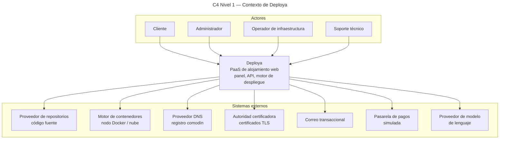
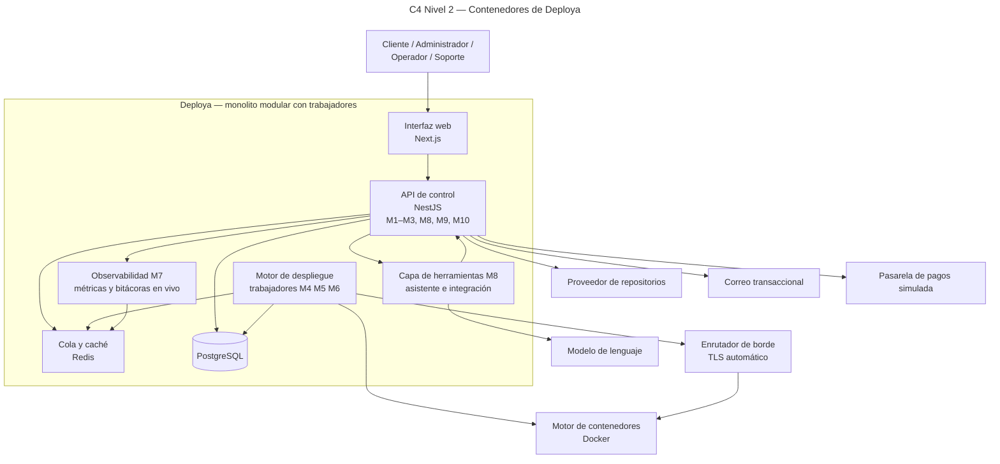

# Arquitectura de Deploya

Lectura corta (C4 + ciclo). Anexo largo: [arquitectura-maestro.md](arquitectura-maestro.md). Producto: [propuesta.md](propuesta.md). Auditoría de nombres: [AUDITORIA_SOLID_CLEAN.md](AUDITORIA_SOLID_CLEAN.md).

Archivos Mermaid únicos: [diagramas/compartido/](diagramas/compartido/).

## Qué es

PaaS de alojamiento: el cliente pasa de un repositorio público de GitHub con `Dockerfile` a una aplicación en línea, con subdominio y certificado HTTPS, sin administrar servidores.

**Alcance núcleo v4.1:** [alcance.md](alcance.md). Los diagramas C4 muestran el diseño completo de la propuesta; lo que el núcleo no implementa (M8, modelo de lenguaje, dominios personalizados, reversión sin reconstruir) queda marcado abajo como fuera de alcance.

Arquitectura: **monolito modular** (NestJS + Next.js) con **trabajadores asíncronos**. PostgreSQL, Redis, Docker, enrutador de borde con TLS automático.

La API no invoca Docker ni el enrutador: pide la operación a adaptadores (`ContenedorPuerto`, `EnrutamientoPuerto`, `VerificacionEntornoPuerto`). Sin prefijo `I`.

## Ciclo de despliegue (§3.2)

Cada despliegue produce un **artefacto versionado e inmutable** (`#n`, digest). En el núcleo, volver a una versión anterior es **redesplegar** ese commit (reconstruye); levantar el artefacto previo sin reconstruir queda fuera de alcance.

| Etapa | Responsable | Resultado |
|---|---|---|
| Recepción | API de control | Se registra el despliegue y se encola la construcción |
| Construcción | Trabajador M4 | Imagen versionada desde el `Dockerfile` del cliente |
| Ejecución | Orquestador M5 | Contenedor con límites de CPU y memoria |
| Enrutamiento | Enrutador M6 | Subdominio, TLS, conmutación de tráfico |
| Operación | Observabilidad M7 | Estado por etapa y bitácora de construcción al panel (polling) |

**Estados de despliegue** (no son los de suscripción): Encolado, Construyendo, Aprovisionando, Publicando, Saludable, Fallido, Cancelado, Detenido (*Revirtiendo* queda fuera de alcance). Diagrama: [m4-m5-m6-estados-despliegue.mmd](diagramas/m1-m10/m4-m5-m6-estados-despliegue.mmd).

**Estados de suscripción** (§4.4): Activa, Por vencer, Vencida, Suspendida, Cancelada. Diagrama: [m2-estados-suscripcion.mmd](diagramas/m1-m10/m2-estados-suscripcion.mmd).

## C4 nivel 1 — contexto

Fuente: [diagramas/compartido/c4-contexto.mmd](diagramas/compartido/c4-contexto.mmd).

## C4 nivel 2 — contenedores

Fuente: [diagramas/compartido/c4-contenedores.mmd](diagramas/compartido/c4-contenedores.mmd).

## C4 nivel 3 — motor (M4–M6)

Fuente: [diagramas/compartido/c4-componentes-motor.mmd](diagramas/compartido/c4-componentes-motor.mmd). La API depende de puertos; Docker y el borde viven detrás de adaptadores.

## Módulos (§6.1) y dueños

| Id | Módulo | Dueño | Código |
|---|---|---|---|
| M1 | Identidad y acceso | Eddy | `apps/api/src/modules/identidad` |
| M2 | Suscripciones y pagos | Javier | `apps/api/src/modules/suscripciones` |
| M3 | Proyectos y fuentes | Eduardo | `apps/api/src/modules/proyectos` |
| M4 | Motor de construcción | Derek | `apps/api/src/modules/construccion` |
| M5 | Orquestación y ejecución | Derek | `apps/api/src/modules/orquestacion` |
| M6 | Enrutamiento y TLS | Derek | `apps/api/src/modules/enrutamiento` |
| M7 | Observabilidad | Eduardo | `apps/api/src/modules/observabilidad` |
| M8 | Asistente e integración — **fuera de alcance** (stub) | Derek | `apps/api/src/modules/herramientas` |
| M9 | Administración | Javier | `apps/api/src/modules/administracion` |
| M10 | Notificaciones | Eddy | `apps/api/src/modules/notificaciones` |

## Sistema de diseño

Canon: [kit-visual.md](kit-visual.md). Geist, tokens claro/oscuro (toggle), cromática monocromática, primitivos shadcn + Lucide; `@xyflow/react` y framer-motion en el package. Las rutas en `apps/web` son **stubs** del kit; cada módulo construye su dominio encima, sin paleta propia ni pantallas fingidas.

## Fuera de alcance

- **Solo si da el tiempo** (orden y detalle en [alcance.md](alcance.md#fuera-de-alcance--solo-si-da-el-tiempo)): M8 completo, métricas en vivo, bitácoras de runtime, dominios personalizados, reversión sin reconstruir, zip y repos privados, detección de stack, renovación automática, complementos, CRUD de planes, roles Operador y Soporte.
- **Nunca** (propuesta §6.2): microservicios, varios nodos y escalado horizontal, CDN, cobro con dinero real, CLI/desktop, previews por PR.
