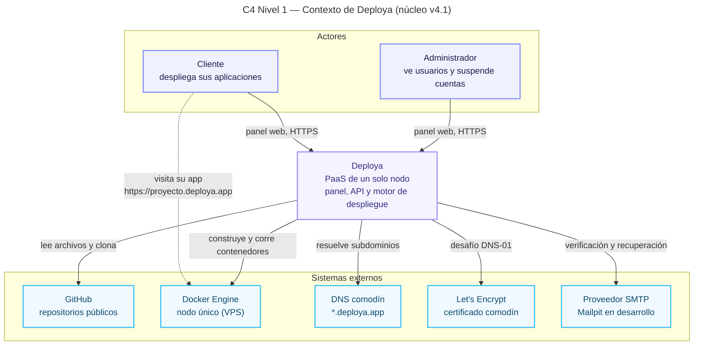
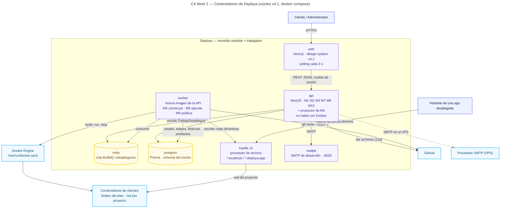

# Arquitectura de Deploya

Lectura corta (C4 + ciclo). Anexo largo: [arquitectura-maestro.md](arquitectura-maestro.md). Producto: [propuesta.md](propuesta.md). Auditoría SOLID: [AUDITORIA_SOLID_CLEAN.md](AUDITORIA_SOLID_CLEAN.md). Estándar de código (SOLID, clean code, patrones, pruebas): [ingenieria.md](ingenieria.md).

Archivos Mermaid únicos: [diagramas/compartido/](diagramas/compartido/).

## Qué es

PaaS de alojamiento: el cliente pasa de un repositorio público de GitHub (con `Dockerfile` o con un stack que Deploya reconoce) a una aplicación en línea, con subdominio y certificado HTTPS, sin administrar servidores.

**Alcance núcleo v4.1:** [alcance.md](alcance.md). Los diagramas C4 están recortados al núcleo; M8, modelo de lenguaje y dominios personalizados quedan fuera. Detección de stack y reversión sin reconstruir **sí** entran (M4-03, M5-04). Datos firmados: [contratos/datos-nucleo.md](contratos/datos-nucleo.md).

Arquitectura: **monolito modular** (NestJS + Next.js) con un **trabajador** aparte (misma imagen, `trabajador.ts`). PostgreSQL, Redis (BullMQ), Docker, Traefik v3 con rutas por archivo y certificado comodín en el VPS.

La API no invoca Docker ni el enrutador: pide la operación a adaptadores (`ContenedorPuerto`, `EnrutamientoPuerto`, `VerificacionEntornoPuerto`). Sin prefijo `I`.

## Ciclo de despliegue (§3.2)

Cada despliegue por construcción produce un **artefacto versionado e inmutable** (`#n`, digest, receta). Se conservan los últimos 5 por proyecto y se puede **revertir** a uno sin reconstruir (estado Revirtiendo); redesplegar un commit sigue existiendo y sí reconstruye.

| Etapa | Responsable | Resultado |
|---|---|---|
| Recepción | API + trabajador M4 | Se registra y encola; el trabajador clona la rama y detecta el stack |
| Construcción | Trabajador M4 | Imagen versionada desde el `Dockerfile` del cliente o una receta de Deploya |
| Ejecución | Orquestador M5 | Contenedor con límites de CPU y memoria |
| Enrutamiento | Trabajador M6 | Ruta de Traefik al contenedor nuevo, TLS, conmutación sin corte |
| Operación | Observabilidad M7 | Estado por etapa y bitácora de construcción al panel (polling) |

**Estados de despliegue** (no son los de suscripción): Encolado, Construyendo, Aprovisionando, Publicando, Saludable, Fallido, Cancelado, Detenido y Revirtiendo. Diagrama: [m4-m5-m6-estados-despliegue.mmd](diagramas/m1-m10/m4-m5-m6-estados-despliegue.mmd).

**Estados de suscripción** (§4.4): Activa, Por vencer, Vencida, Suspendida, Cancelada. Diagrama: [m2-estados-suscripcion.mmd](diagramas/m1-m10/m2-estados-suscripcion.mmd).

## C4 nivel 1 — contexto

Fuente: [diagramas/compartido/c4-contexto.mmd](diagramas/compartido/c4-contexto.mmd).

<!-- diagrama: docs/diagramas/compartido/c4-contexto.mmd -->

```mermaid
---
title: C4 Nivel 1 — Contexto de Deploya (núcleo v4.1)
---
flowchart TB
    subgraph ACTORES["Actores"]
        CLIENTE["Cliente<br/>despliega sus aplicaciones"]
        ADMIN["Administrador<br/>ve usuarios y suspende cuentas"]
    end

    DEPLOYA["Deploya<br/>PaaS de un solo nodo<br/>panel, API y motor de despliegue"]

    subgraph EXTERNOS["Sistemas externos"]
        GIT["GitHub<br/>repositorios públicos"]
        DOCKER["Docker Engine<br/>nodo único (VPS)"]
        DNS["DNS comodín<br/>*.deploya.app"]
        CA["Let's Encrypt<br/>certificado comodín"]
        CORREO["Proveedor SMTP<br/>Mailpit en desarrollo"]
    end

    CLIENTE -->|"panel web, HTTPS"| DEPLOYA
    ADMIN -->|"panel web, HTTPS"| DEPLOYA
    CLIENTE -.->|"visita su app<br/>https://proyecto.deploya.app"| DOCKER

    DEPLOYA -->|"lee archivos y clona"| GIT
    DEPLOYA -->|"construye y corre contenedores"| DOCKER
    DEPLOYA -->|"resuelve subdominios"| DNS
    DEPLOYA -->|"desafío DNS-01"| CA
    DEPLOYA -->|"verificación y recuperación"| CORREO

    classDef actor fill:#eef2ff,stroke:#818cf8,stroke-width:2px,color:#1e1b4b
    classDef sistema fill:#f5f3ff,stroke:#a78bfa,stroke-width:2px,color:#312e81
    classDef externo fill:#f0f9ff,stroke:#38bdf8,stroke-width:2px,color:#0c4a6e
    class CLIENTE,ADMIN actor
    class DEPLOYA sistema
    class GIT,DOCKER,DNS,CA,CORREO externo
```

## C4 nivel 2 — contenedores

Fuente: [diagramas/compartido/c4-contenedores.mmd](diagramas/compartido/c4-contenedores.mmd).

<!-- diagrama: docs/diagramas/compartido/c4-contenedores.mmd -->

```mermaid
---
title: C4 Nivel 2 — Contenedores de Deploya (núcleo v4.1, docker compose)
---
flowchart TB
    CLIENTE["Cliente / Administrador"]
    VISITANTE["Visitante de una app desplegada"]

    subgraph DEPLOYA["Deploya — monolito modular + trabajador"]
        WEB["web<br/>Next.js · design system v4.1<br/>polling cada 3 s"]
        API["api<br/>NestJS · M1 M2 M3 M7 M9 M10<br/>+ productor de M4<br/>no habla con Docker"]
        WORKER["worker<br/>misma imagen de la API<br/>M4 construye · M5 ejecuta · M6 publica"]
        REDIS[("redis<br/>cola BullMQ «despliegues»")]
        BD[("postgres<br/>Prisma · schema del núcleo")]
        EDGE["traefik v3<br/>proveedor de archivo<br/>*.localhost / *.deploya.app"]
        MAILPIT["mailpit<br/>SMTP de desarrollo · :8025"]
    end

    DOCKER["Docker Engine<br/>/var/run/docker.sock"]
    APPS["Contenedores de clientes<br/>límites del plan · red por proyecto"]
    GIT["GitHub"]
    SMTP["Proveedor SMTP (VPS)"]

    CLIENTE -->|HTTPS| WEB
    WEB -->|"REST JSON, cookie de sesión"| API
    API --> BD
    API -->|"encola TrabajoDespliegue"| REDIS
    API -->|"lee archivos (11a)"| GIT
    API -->|"SMTP"| MAILPIT
    API -.->|"SMTP en el VPS"| SMTP
    WORKER -->|"consume"| REDIS
    WORKER -->|"estado, etapas, bitácora, artefactos"| BD
    WORKER -->|"git clone --depth 1"| GIT
    WORKER -->|"build, run, stop"| DOCKER
    WORKER -->|"escribe rutas dinámicas"| EDGE
    DOCKER --> APPS
    VISITANTE -->|"http(s)://proyecto.dominio"| EDGE
    EDGE -->|"red del proyecto"| APPS

    classDef persona fill:#eef2ff,stroke:#818cf8,stroke-width:2px,color:#1e1b4b
    classDef app fill:#f5f3ff,stroke:#a78bfa,stroke-width:2px,color:#312e81
    classDef data fill:#fefce8,stroke:#facc15,stroke-width:2px,color:#713f12
    classDef ext fill:#f0f9ff,stroke:#38bdf8,stroke-width:2px,color:#0c4a6e
    class CLIENTE,VISITANTE persona
    class WEB,API,WORKER,EDGE,MAILPIT app
    class REDIS,BD data
    class DOCKER,APPS,GIT,SMTP ext
```

## C4 nivel 3 — motor (M4–M6)

Fuente: [diagramas/compartido/c4-componentes-motor.mmd](diagramas/compartido/c4-componentes-motor.mmd). La API depende de puertos; Docker y el borde viven detrás de adaptadores. Despliegue en el nodo: [despliegue-infraestructura.mmd](diagramas/compartido/despliegue-infraestructura.mmd). Recorrido de punta a punta: [secuencia-recorrido-e2e.mmd](diagramas/compartido/secuencia-recorrido-e2e.mmd). Decisiones: [ADR 0002–0005](adr/README.md).

## Módulos (§6.1) y dueños

| Id | Módulo | Dueño | Código |
|---|---|---|---|
| M1 | Identidad y acceso | Eddy | `apps/api/src/modules/identidad` |
| M2 | Suscripciones y pagos | Javier | `apps/api/src/modules/suscripciones` |
| M3 | Proyectos y fuentes | Eduardo | `apps/api/src/modules/proyectos` |
| M4 | Motor de construcción | Derek | `apps/api/src/modules/construccion` |
| M5 | Orquestación y ejecución | Derek | `apps/api/src/modules/orquestacion` |
| M6 | Enrutamiento y TLS | Derek | `apps/api/src/modules/enrutamiento` |
| M7 | Observabilidad | Eduardo | `apps/api/src/modules/observabilidad` |
| M8 | Asistente e integración — **fuera de alcance** (stub) | Derek | `apps/api/src/modules/herramientas` |
| M9 | Administración | Javier | `apps/api/src/modules/administracion` |
| M10 | Notificaciones | Eddy | `apps/api/src/modules/notificaciones` |

## Sistema de diseño

Fuente madre: [diseno/](diseno/README.md). Design system v4.1: claro por defecto, neutros cálidos, acento Señal solo para lo que está en curso, Geist / Geist Mono, Lucide, componentes propios en `apps/web/src/components` (catálogo en `/sistema`). Cada pantalla tiene su ficha en `diseno/pantallas/`.

## Fuera de alcance

- **Solo si da el tiempo** (orden y detalle en [alcance.md](alcance.md#fuera-de-alcance--solo-si-da-el-tiempo)): M8 completo, métricas en vivo, bitácoras de runtime, dominios personalizados, zip y repos privados, buildpacks, renovación automática, complementos, CRUD de planes, roles Operador y Soporte.
- **Nunca** (propuesta §6.2): microservicios, varios nodos y escalado horizontal, CDN, cobro con dinero real, CLI/desktop, previews por PR.
